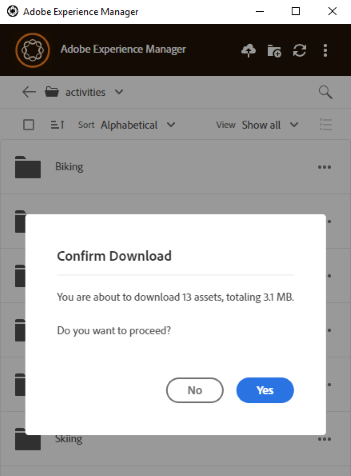

# Lokales Herunterladen von Assets {#download-assets-locally}

Die App lädt häufig Assets vom [!DNL Experience Manager] in Ihr lokales Dateisystem herunter. Die Downloads verbrauchen Bandbreite und Speicherplatz. Wenn Sie die Szenarien kennen, können Sie Ihre Wartezeit bis zum Abschluss der Downloads optimieren. Sie können die Assets auf Ihr lokales Dateisystem herunterladen. Die App ruft die Assets vom [!DNL Experience Manager] ab und speichert dieselbe Kopie auf Ihrem lokalen Dateisystem.

Klicken Sie auf **[!UICONTROL More actions]**  für Optionen und klicken Sie auf &quot; zum Herunterladen.

>[!NOTE]
>
>Beim Herunterladen oder Hochladen einer oder mehrerer Dateien deaktiviert das Programm die Aktionen für Assets und Ordner. Die Aktionen sind verfügbar, wenn der Download oder Upload abgeschlossen ist.

Wenn Sie mit der Aktion [!UICONTROL Open] ein Asset in einem nativen Desktop-Programm öffnen, wird das Asset lokal heruntergeladen, wenn es nicht bereits lokal verfügbar ist. Siehe [Öffnen von Assets](#openondesktop-v2).

Wenn Sie den Speicherort eines Assets oder Ordners im Programm anzeigen, wird das Asset oder der Ordner zunächst lokal heruntergeladen und dann auf Ihrem Computer in der lokalen Netzwerkfreigabe geöffnet. Siehe [Öffnen von Assets](#openondesktop-v2).

Wenn Sie die Aktion [!UICONTROL Edit] zum Bearbeiten eines Assets in einem nativen Desktop-Programm verwenden, wird das Asset lokal heruntergeladen, wenn es nicht bereits lokal verfügbar ist. Siehe [Bearbeiten von Assets und Hochladen aktualisierter Assets in [!DNL Experience Manager]](#edit-assets-upload-updated-assets).

Wenn die App installiert und zugelassen ist, werden die Aktionen abgeschlossen, wenn Sie [!UICONTROL Desktop Actions] über [!DNL Experience Manager] Web-Oberfläche verwenden. Das Programm lädt das Asset zuerst herunter und schließt dann die Aktion ab.

## Mehrere Assets herunterladen {#download-multiple-assets}

Das Herunterladen mehrerer Assets kann zu Leistungseinbußen führen, wenn die Warteschlange groß ist oder ein Netzwerkproblem vorliegt. Außerdem können Sie unwissentlich viele Assets zum Herunterladen in eine Warteschlange stellen, wenn Sie einen Ordner herunterladen. Um lange Wartezeiten zu vermeiden, beschränkt die App die Anzahl der Assets, die in einem Schritt heruntergeladen werden. Informationen zum Konfigurieren finden Sie unter [Festlegen von Voreinstellungen](install-upgrade.md#set-preferences). Selbst unterhalb dieser Grenze kann das Programm manchmal eine Bestätigung abfragen, bevor ein scheinbar großer Ordner heruntergeladen wird.

Wenn Ordner ausgewählt und heruntergeladen werden, lädt die Anwendung nur Assets herunter, die direkt in den Ordnern in [!DNL Experience Manager] gespeichert sind. Assets werden nicht automatisch aus Unterordnern heruntergeladen.

## Nächste Schritte {#next-steps}

* [Video zu den ersten Schritten mit dem Adobe Experience Manager Desktop-Programm ansehen](https://experienceleague.adobe.com/en/docs/experience-manager-learn/assets/creative-workflows/aem-desktop-app)

* Geben Sie Feedback zur Dokumentation über [!UICONTROL Edit this page] ) oder [!UICONTROL Log an issue]  in der rechten Seitenleiste

* Kontaktieren Sie die [Kundenunterstützung](https://experienceleague.adobe.com/de?support-solution=General#support)

>[!MORELIKETHIS]
>
>* [Hochladen von Assets](/help/using/upload-assets.md)
>* [Grundlegendes zur Benutzeroberfläche](/help/using/user-interface.md)
>* [Suchen](/help/using/search.md)

