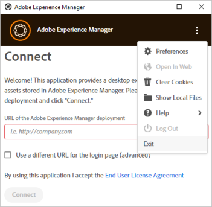

# Fehlerbehebung für das [!DNL Adobe Experience Manager]-Desktop-Programm {#troubleshoot-v2}

Das [!DNL Adobe Experience Manager] -Desktop-Programm stellt eine Verbindung zum DAM-Repository (Digital Asset Management) einer [!DNL Experience Manager] -Implementierung her. Das Programm ruft Repository-Informationen und Suchergebnisse auf Ihrem Computer ab, lädt Dateien und Ordner herunter und lädt sie hoch und bietet Funktionen zum Verwalten von Konflikten mit der Assets-Benutzeroberfläche.

Lesen Sie weiter, um Fehler im Programm zu beheben, lernen Sie die Best Practices kennen und erfahren Sie mehr über Einschränkungen.

## Best Practices {#best-practices-to-prevent-troubles}

Befolgen Sie die folgenden Best Practices, um einige häufige Probleme zu vermeiden, und für die Fehlerbehebung.

* **So funktioniert das Desktop-Programm**: Bevor Sie mit der Verwendung des Programms beginnen, sollten Sie sich kurz mit ihrer Funktionsweise vertraut machen. Erfahren Sie mehr über die Verknüpfung zwischen der Web-Oberfläche von [!DNL Experience Manager] und dem Desktop, Repository-Zuordnung, Asset-Zwischenspeicherung, lokales Speichern und Hochladen im Hintergrund. Machen Sie sich mit der [Funktionsweise](release-notes.md#how-app-works) vertraut.

* **Vermeiden Sie nicht unterstützte Zeichen in Ordnernamen**: Verwenden Sie beim Erstellen oder Hochladen von Ordnern keine Leerzeichen und ungültige Zeichen. Eine Liste der Zeichen finden Sie unter [Erstellen von Ordnern in  [!DNL Adobe Experience Manager Assets]](https://experienceleague.adobe.com/en/docs/experience-manager-65/content/assets/managing/manage-assets#creating-folders). Nicht unterstützte Zeichen im Ordnernamen können sich auf einige [!DNL Experience Manager] -Anwendungsfälle auswirken.

* **Best Practices zur Vermeidung von Konflikten**: Um potenzielle Konflikte bei der Zusammenarbeit mit mehreren Assets zu vermeiden, gehen Sie zu [Vermeiden von Bearbeitungskonflikten](using.md#adv-workflow-collaborate-avoid-conflicts).

* **Verwenden Sie den Ordner-Upload für große, hierarchische Ordner**: Verwenden Sie anstelle der Assets-Web-Oberfläche oder anderer Methoden das [!DNL Experience Manager] -Desktop-Programm, um große Ordner hochzuladen. Das Programm lädt die Assets mit Protokollierung und Überwachung im Hintergrund hoch. Siehe [Massen-Upload von Assets](using.md#bulk-upload-assets).

* **Verwenden Sie die neueste Version**: Verwenden Sie die neueste App-Version. Überprüfen Sie immer die Kompatibilität, bevor Sie eine neue App-Version installieren oder bevor Sie auf eine neuere [!DNL Experience Manager] -Version aktualisieren. Siehe [Versionshinweise](release-notes.md).

* **Verwenden Sie denselben Laufwerksbuchstaben**: Verwenden Sie in der gesamten Organisation denselben Laufwerksbuchstaben für das [!DNL Experience Manager]-DAM. Damit von anderen Benutzern platzierte Assets angezeigt werden können, müssen die Pfade identisch sein. Mit demselben Laufwerksbuchstaben wird ein konstanter Pfad zu DAM-Assets sichergestellt. Die Assets bleiben platziert und werden auch dann nicht entfernt, wenn verschiedene Laufwerksbuchstaben von verschiedenen Benutzern verwendet werden.

* **Denken Sie an das Netzwerk**: Die Netzwerkleistung ist von entscheidender Bedeutung für die Leistung des [!DNL Experience Manager]-Desktop-Programms. Wenn die Reaktion auf Dateiübertragungen oder Massenvorgänge verlangsamt ist, deaktivieren Sie die Funktionen oder Apps, die zu viel Netzwerk-Traffic führen können.

* **Nicht unterstützte Anwendungsfälle für das Desktop-Programm**: Vermeiden Sie die Verwendung des Programms für die Asset-Migration, da hierfür Planung und zusätzliche Tools erforderlich sind. Sie ist auch nicht für DAM-Vorgänge mit hoher Leistung geeignet, z. B. das Verschieben großer Ordner, große Uploads oder erweiterte Metadatensuchen. Verwenden Sie es außerdem nicht als Synchronisierungs-Client, da sich die Designprinzipien und Nutzungsmuster des Clients von den Synchronisierungs-Clients wie Microsoft OneDrive oder Adobe Creative Cloud Desktop Sync unterscheiden.

* **Zeitüberschreitung**: Derzeit weist das Desktop-Programm keinen konfigurierbaren Timeout-Wert auf, um die Verbindung zwischen dem [!DNL Experience Manager] -Server und dem Desktop-Programm nach einem bestimmten Zeitintervall zu trennen. Wenn beim Hochladen großer Assets nach einiger Zeit ein Verbindungs-Timeout eintritt, versucht das Programm, das Asset einige Male hochzuladen, indem es den Timeout-Wert für den Upload erhöht. Es gibt keine empfohlene Vorgehensweise, um die Standardeinstellungen für den Timeout zu ändern.

## Fehlerbehebung {#troubleshooting-prep}

Um Probleme mit dem Desktop-Programm zu beheben, beachten Sie die folgenden Informationen. Außerdem werden Sie darauf vorbereitet, die Probleme besser an den Adobe-Support weiterzuleiten, wenn Sie sich für den Support entscheiden.

### Speicherort der Protokolldateien {#check-log-files-v2}

Das [!DNL Experience Manager] -Desktop-Programm speichert seine Protokolldateien je nach Betriebssystem an den folgenden Speicherorten:

Unter Windows: `%LocalAppData%\Adobe\AssetsCompanion\Logs`

Unter macOS: `~/Library/Logs/Adobe\ Experience\ Manager\ Desktop`

Wenn beim Hochladen vieler Assets einige Dateien nicht hochgeladen werden können, finden Sie in der Datei `backend.log` Informationen zu den fehlgeschlagenen Uploads.

>[!NOTE]
>
>Wenn Sie mit dem Adobe-Support an einer Support-Anfrage/einem Ticket arbeiten, werden Sie möglicherweise aufgefordert, die Protokolldateien zu teilen, damit das Support-Team das Problem verstehen kann. Archivieren Sie den gesamten Ordner `Logs` und geben Sie ihn für Ihre Kontaktperson beim Support frei.

### Ändern der Detailebene in Protokolldateien {#level-of-details-in-log}

So ändern Sie die Detailebene in Protokolldateien:

1. Stellen Sie sicher, dass die Anwendung nicht ausgeführt wird.

1. Windows-System:

   1. Öffnen Sie ein Befehlsfenster.

   1. Starten Sie das [!DNL Adobe Experience Manager] -Desktop-Programm, indem Sie den Befehl ausführen:

   ```shell
   set AEM_DESKTOP_LOG_LEVEL=DEBUG&"C:\Program Files\Adobe\Adobe Experience Manager Desktop.exe
   ```

   Mac-System:

   1. Öffnen Sie ein Terminal-Fenster.

   1. Starten Sie das [!DNL Adobe Experience Manager] -Desktop-Programm, indem Sie den Befehl ausführen:

   ```shell
   AEM_DESKTOP_LOG_LEVEL=DEBUG open /Applications/Adobe\ Experience\ Manager\ Desktop.app
   ```

Die gültigen Protokollebenen sind DEBUG, INFO, WARN oder ERROR. Die Ausführlichkeit der Protokolle ist in DEBUG am höchsten und in ERROR am niedrigsten.

### Aktivieren des Debug-Modus {#enable-debug-mode}

Zur Fehlerbehebung können Sie den Debug-Modus aktivieren und weitere Informationen in den Protokollen abrufen.

>[!NOTE]
>
>Gültige Protokollebenen sind DEBUG, INFO, WARN oder ERROR. Die Ausführlichkeit der Protokolle ist in DEBUG am höchsten und in ERROR am niedrigsten.

So verwenden Sie das Programm im Debug-Modus auf einem Mac:

1. Öffnen Sie ein Terminal-Fenster oder eine Eingabeaufforderung.

1. Starten Sie das [!DNL Experience Manager]-Desktop-Programm, indem Sie den folgenden Befehl ausführen:

   `AEM_DESKTOP_LOG_LEVEL=DEBUG open /Applications/Adobe\ Experience\ Manager\ Desktop.app`.

So aktivieren Sie den Debug-Modus unter Windows:

1. Öffnen Sie ein Befehlsfenster.

1. Starten Sie das [!DNL Experience Manager]-Desktop-Programm, indem Sie den folgenden Befehl ausführen:

`AEM_DESKTOP_LOG_LEVEL=DEBUG&"C:\Program Files\Adobe\Adobe Experience Manager Desktop.exe`.

### Ermitteln der [!DNL Adobe Experience Manager]-Desktop-Programm-Version {#know-app-version-v2}

So zeigen Sie die Versionsnummer an:

1. Starten Sie das Programm.

1. Klicken Sie auf die Auslassungszeichen in der oberen rechten Ecke, halten Sie den Mauszeiger über [!UICONTROL Help] und klicken Sie auf [!UICONTROL About].

   Daraufhin wird die Versionsnummer auf dem Bildschirm angezeigt.

### Löschen des Cache {#clear-cache-v2}

Führen Sie die folgenden Schritte durch:

1. Starten Sie das Programm und verbinden Sie sich mit einer Instanz von [!DNL Experience Manager].

1. Öffnen Sie die Voreinstellungen des Programms, indem Sie auf die Auslassungspunkte in der oberen rechten Ecke klicken und die Option [!UICONTROL Preferences] auswählen.

1. Gehen Sie zum Eintrag, der die [!UICONTROL Current Cache Size] anzeigt. Klicken Sie auf das Papierkorbsymbol neben diesem Element.

Gehen Sie wie folgt vor, um den Cache manuell zu löschen:

>[!CAUTION]
>
>Diese Schritte sind ein potenziell destruktiver Vorgang. Wenn lokale Dateiänderungen vorliegen, die nicht in [!DNL Adobe Experience Manager] hochgeladen werden, gehen diese Änderungen verloren.

Der Cache wird gelöscht, indem das Cache-Verzeichnis des Programms gelöscht wird. Zu finden ist es in den Voreinstellungen des Programms.

1. Starten Sie das Programm.

1. Öffnen Sie die Voreinstellungen des Programms, indem Sie die Auslassungspunkte in der oberen rechten Ecke auswählen und dann [!UICONTROL Preferences] auswählen.

1. Notieren Sie den Wert für [!UICONTROL Cache Directory].

   In diesem Verzeichnis befinden sich Unterverzeichnisse, die nach den kodierten [!DNL Adobe Experience Manager] Endpunkten benannt sind. Die Namen sind eine kodierte Version der Ziel-URL [!DNL Adobe Experience Manager]. Wenn die Anwendung beispielsweise das Ziel `localhost:4502` hat, ist der Verzeichnisname `localhost_4502`.

Wenn Sie den Cache löschen möchten, löschen Sie das Verzeichnis „Codierter [!DNL Adobe Experience Manager]-Endpunkt“. Wenn Sie alternativ das gesamte in den Voreinstellungen angegebene Verzeichnis löschen, wird der Cache für alle vom Programm verwendeten Instanzen gelöscht.

Beim Löschen des Caches des [!DNL Adobe Experience Manager]-Desktop-Programms handelt es sich um eine vorläufige Aufgabe zur Fehlerbehebung, durch die verschiedene Probleme gelöst werden können. Löschen Sie den Cache in den Programm-Voreinstellungen. Siehe [Festlegen von Voreinstellungen](install-upgrade.md#set-preferences). Der Standardspeicherort des Cache-Ordners ist:

## Platzierte Assets werden nicht angezeigt {#placed-assets-missing}

Wenn Sie die Assets, die Sie oder andere Kreativprofis in den Support-Dateien gespeichert haben (z. B. INDD-Dateien), nicht sehen können, überprüfen Sie Folgendes:

* Verbindung zum Server. Instabile Netzwerkverbindungen können das Herunterladen von Assets verzögern.

* Dateigröße. Das Herunterladen und Anzeigen großer Assets dauert länger.

* Konsistenz der Laufwerksbuchstaben. Wenn Sie oder ein anderer Mitarbeiter die Assets platziert haben, während das [!DNL Experience Manager]-DAM einem anderen Laufwerksbuchstaben zugeordnet war, werden die platzierten Assets nicht angezeigt.

* Berechtigungen. Um zu prüfen, ob Sie berechtigt sind, die platzierten Assets abzurufen, wenden Sie sich an Ihren [!DNL Experience Manager]-Administrator.

### Änderungen an Dateien in der Benutzeroberfläche des Desktop-Programms werden nicht sofort in [!DNL Adobe Experience Manager] angezeigt {#changes-on-da-not-visible-on-aem}

Das [!DNL Adobe Experience Manager]-Desktop-Programm überlässt es dem Benutzer, zu entscheiden, wann alle Änderungen an einer Datei abgeschlossen sind. Je nach Größe und Komplexität einer Datei dauert es sehr lange, die neue Version einer Datei wieder zurück auf [!DNL Adobe Experience Manager] zu übertragen. Die Anwendung soll die Anzahl der Dateiübertragungen minimieren, anstatt Dateien automatisch hochzuladen, basierend auf der vermuteten Fertigstellung von Bearbeitungen. Es wird empfohlen, dass der Benutzer die Übertragung der Datei zurück in [!DNL Adobe Experience Manager] einleitet, indem er die Änderungen einer Datei hochlädt.

### Probleme beim Aktualisieren unter macOS {#issues-when-upgrading-on-macos}

Gelegentlich können beim Aktualisieren des [!DNL Experience Manager] -Desktop-Programms auf macOS Probleme auftreten. Diese Probleme werden durch ältere Systemordner für das [!DNL Experience Manager] -Desktop-Programm verursacht. Die Ordner verhindern, dass neue Versionen des [!DNL Experience Manager] -Desktop-Programms korrekt geladen werden. Zur Behebung dieses Problems können die folgenden Ordner und Dateien manuell entfernt werden.

Ziehen Sie vor dem Ausführen der folgenden Schritte die Anwendung `Adobe Experience Manager Desktop` aus dem Ordner &quot;macOS-Anwendungen&quot;in den Papierkorb. Öffnen Sie dann das Terminal, führen Sie den folgenden Befehl aus und geben Sie Ihr Kennwort ein, wenn Sie dazu aufgefordert werden.

```shell
sudo rm -rf ~/Library/Application\ Support/com.adobe.aem.desktop
sudo rm -rf ~/Library/Preferences/com.adobe.aem.desktop.plist
sudo rm -rf ~/Library/Logs/Adobe\ Experience\ Manager\ Desktop

sudo find /var/folders -type d -name "com.adobe.aem.desktop" | xargs rm -rf
sudo find /var/folders -type d -name "com.adobe.aem.desktop.finderintegration-plugin" | xargs rm -rf
```

## Dateien können nicht hochgeladen werden {#upload-fails}

Wenn Sie das Desktop-Programm mit [!DNL Experience Manager] 6.5.1 oder höher verwenden, aktualisieren Sie den S3- oder Azure-Connector auf Version 1.10.4 oder höher. Dadurch wird das Problem mit dem Fehler beim Hochladen von Dateien im Zusammenhang mit [OAK-8599](https://issues.apache.org/jira/browse/OAK-8599) behoben. Siehe [Installationsanweisungen](install-upgrade.md#install-v2).

## Verbindungsprobleme mit dem [!DNL Experience Manager]-Desktop-Programm {#connection-issues}

Wenn allgemeine Verbindungsprobleme auftreten, finden Sie hier einige Möglichkeiten, weitere Informationen zur Arbeit des [!DNL Experience Manager]-Desktop-Programms zu erhalten.

**Überprüfen des Anfrageprotokolls**

Das [!DNL Experience Manager] -Desktop-Programm protokolliert alle gesendeten Anfragen zusammen mit dem Antwort-Code jeder Anfrage in einer dedizierten Protokolldatei.

1. Öffnen Sie `request.log` im Protokollverzeichnis des Programms, um diese Anfragen anzuzeigen.

1. Jede Zeile im Protokoll stellt entweder eine Anfrage oder eine Antwort dar. Anforderungen haben das Zeichen &quot;`>`&quot;, gefolgt von der angeforderten URL. Antworten haben ein `<` -Zeichen, gefolgt vom Antwort-Code und der angeforderten URL. Anfragen und Antworten können mit der GUID jeder Zeile abgeglichen werden.

**Überprüfen von Anfragen, die vom eingebetteten Browser des Programms geladen wurden**

Die meisten Anfragen des Programms finden Sie im Anfrageprotokoll. Wenn es dort keine hilfreichen Informationen gibt, können Sie sich die vom eingebetteten Browser des Programms gesendeten Anfragen ansehen.
Anweisungen zur Ansicht dieser Anfragen finden Sie im [Abschnitt zu SAML](#da-connection-issue-with-saml-aem).

### SAML-Anmeldeauthentifizierung funktioniert nicht {#da-connection-issue-with-saml-aem}

Das [!DNL Experience Manager]-Desktop-Programm stellt möglicherweise keine Verbindung zu Ihrer SSO-fähigen (SAML) [!DNL Adobe Experience Manager]-Bereitstellung her. Das Programm-Design versucht, die Variationen und Komplexitäten von SSO-Verbindungen und -Prozessen zu berücksichtigen. Eine Konfiguration kann jedoch eine zusätzliche Fehlerbehebung erfordern.

Manchmal leitet der SAML-Prozess nicht zum ursprünglich angeforderten Pfad zurück. Oder die endgültige Umleitung erfolgt zu einem Host, der sich von dem unterscheidet, der im [!DNL Adobe Experience Manager] -Desktop-Programm konfiguriert ist. Gehen Sie wie folgt vor, um sicherzustellen, dass dieses Problem nicht zutrifft:

1. Öffnen Sie einen Webbrowser. Rufen Sie die `https://[aem_server]:[port]/content/dam.json`-URL auf.

1. Melden Sie sich bei der [!DNL Adobe Experience Manager]-Bereitstellung an.

1. Wenn die Anmeldung abgeschlossen ist, sehen Sie sich die aktuelle Adresse des Browsers in der Adressleiste an. Sie sollte genau mit der ursprünglich von Ihnen eingegeben URL übereinstimmen.

1. Überprüfen Sie außerdem, ob alles vor `/content/dam.json` mit dem Zielwert von [!DNL Adobe Experience Manager], der in den Einstellungen des [!DNL Adobe Experience Manager]-Desktop-Programms konfiguriert ist, übereinstimmt.

**Der SAML-Anmeldeprozess funktioniert gemäß den oben genannten Schritten ordnungsgemäß, aber die Benutzer können sich immer noch nicht bei** anmelden.

Das Fenster innerhalb des [!DNL Adobe Experience Manager] -Desktop-Programms, in dem der Anmeldeprozess angezeigt wird, ist lediglich ein Webbrowser, in dem die Web-Benutzeroberfläche der Ziel-1-Instanz angezeigt wird:[!DNL Adobe Experience Manager]

* Die Mac-Version verwendet eine [WebView](https://developer.apple.com/documentation/webkit/webview).

* Die Windows-Version verwendet Chromium-basiertes [CefSharp](https://cefsharp.github.io/).

Stellen Sie sicher, dass der SAML-Prozess diese Browser unterstützt.

Zur weiteren Fehlerbehebung können die exakten URLs, die der Browser zu laden versucht, angezeigt werden. So sehen Sie diese Informationen:

1. Befolgen Sie die Anweisungen zum Starten des Programms im [Debug-Modus](#enable-debug-mode).

1. Reproduzieren Sie den Anmeldeversuch.

1. Navigieren Sie zum Ordner [log](#check-log-files-v2) des Programms.

1. Für Windows:

   1. Öffnen Sie &quot;aembegleitonlog.txt&quot;.

   1. Suchen Sie nach Meldungen, die mit &quot;Login browser address changed to&quot;beginnen. Diese Einträge enthalten auch die URL, die das Programm geladen hat.

   Für Mac:

   1. Ersetzen Sie in `com.adobe.aem.desktop-nnnnnnnn-nnnnnn.log`, je nachdem, welche Zahlen im neuesten Dateinamen stehen, **n**.

   1. Suchen Sie nach Nachrichten, die mit &quot;loaded frame&quot;beginnen. Diese Einträge enthalten auch die URL, die das Programm geladen hat.

Wenn Sie sich die URL-Sequenz ansehen, die geladen wird, können Sie die Fehlerbehebung am SAML-Ende durchführen, um festzustellen, was falsch ist.

### Problem bei der SSL-Konfiguration {#ssl-config-v2}

Die Bibliotheken, die das [!DNL Experience Manager] -Desktop-Programm für die HTTP-Kommunikation verwendet, verwenden eine strikte SSL-Durchsetzung. Manchmal kann eine Verbindung über einen Browser erfolgreich hergestellt werden, schlägt aber bei der Verwendung des [!DNL Experience Manager] -Desktop-Programms fehl. Installieren Sie für eine ordnungsgemäße SSL-Konfiguration das fehlende Zwischenzertifikat in Apache. Siehe [How to install an Intermediate CA cert in Apache](https://access.redhat.com/solutions/43575) (nur auf Englisch verfügbar).

Die Bibliotheken, die das [!DNL Experience Manager] -Desktop-Programm für die HTTP-Kommunikation verwendet, verwenden eine strikte SSL-Durchsetzung. Es kann also Fälle geben, in denen SSL-Verbindungen, die über einen Browser erfolgreich sind, mit dem [!DNL Adobe Experience Manager] -Desktop-Programm fehlschlagen. Dieses Ergebnis ist gut, da es die korrekte Konfiguration von SSL fördert und die Sicherheit erhöht, aber frustrierend sein kann, wenn die Anwendung keine Verbindung herstellen kann.

Der empfohlene Ansatz in diesem Fall besteht darin, ein Tool zu verwenden, um das SSL-Zertifikat eines Servers zu analysieren und Probleme zu identifizieren, damit diese korrigiert werden können. Es gibt Websites, die das Zertifikat eines Servers überprüfen, indem sie dessen URL angeben.

Als vorübergehende Maßnahme ist es möglich, die strikte SSL-Durchsetzung im [!DNL Adobe Experience Manager] -Desktop-Programm zu deaktivieren. Dieser Ansatz ist keine empfohlene langfristige Lösung, da dadurch die Sicherheit verringert wird, indem die Ursache für falsch konfigurierte SSL ausgeblendet wird. So deaktivieren Sie die strikte Durchsetzung:

1. Verwenden Sie den Editor Ihrer Wahl, um die JavaScript-Konfigurationsdatei der Anwendung zu bearbeiten, die (standardmäßig) an den folgenden Speicherorten (je nach Betriebssystem) zu finden ist:

   Unter macOS: `/Applications/Adobe Experience Manager Desktop.app/Contents/Resources/javascript/lib-smb/config.json`

   Unter Windows: `C:\Program Files (x86)\Adobe\Adobe Experience Manager Desktop\javascript\config.json`

1. Suchen Sie den folgenden Abschnitt in der Datei:

   ```shell
   ...
   "assetRepository": {
       "options": {
   ...
   ```

1. Ändern Sie den Abschnitt, indem Sie `"strictSSL": false` wie folgt hinzufügen:

   ```shell
   ...
   "assetRepository": {
       "options": {
           "strictSSL": false,
   ...
   ```

1. Speichern Sie die Datei und starten Sie das [!DNL Adobe Experience Manager] -Desktop-Programm neu.

### Probleme bei der Anmeldung beim Wechsel zu einem anderen Server {#cannot-login-cookies-issue}

Wenn Sie nach der Verwendung eines [!DNL Experience Manager]-Servers versuchen, die Verbindung zu einem anderen Server zu ändern, treten möglicherweise Anmeldeprobleme auf. Der Grund hierfür sind alte Cookies, die die neue Authentifizierung beeinträchtigen. Die Option [!UICONTROL Clear Cookies] im Hauptmenü hilft hierbei. Melden Sie sich bei der aktuellen Programmsitzung ab und wählen Sie [!UICONTROL Clear Cookies], bevor Sie mit der Herstellung der Verbindung fortfahren.



## Das Programm reagiert nicht {#unresponsive}

In seltenen Fällen reagiert das Programm möglicherweise nicht mehr, zeigt nur einen weißen Bildschirm an oder zeigt einen Fehler am unteren Rand der Benutzeroberfläche an, ohne dass Optionen auf der Benutzeroberfläche vorhanden sind. Versuchen Sie Folgendes in genannter Reihenfolge:

* Klicken Sie mit der rechten Maustaste auf die Programmoberfläche und klicken Sie auf **[!UICONTROL Refresh]**.
* Beenden Sie das Programm und starten Sie es erneut.

Bei beiden Methoden startet das Programm im Stammordner des DAM.

## Ausblenden abgelaufener Assets {#hide-expired-assets}

Beim Durchsuchen von Assets über die Benutzeroberfläche von [!DNL Experience Manager] werden die abgelaufenen Assets nicht angezeigt. Administratoren können Einstellungen konfigurieren, um das Anzeigen, Suchen und Abrufen abgelaufener Assets beim Durchsuchen des Desktop-Programms und von Asset Link zu verhindern. Dadurch wird sichergestellt, dass während dieser Vorgänge kein Zugriff auf abgelaufene Assets möglich ist. Die Konfiguration funktioniert für alle Benutzer, unabhängig von den Administratorberechtigungen.

* [Konfiguration in Experience Manager 6.5 zum Ausblenden abgelaufener Assets](https://experienceleague.adobe.com/en/docs/experience-manager-65/content/assets/managing/manage-assets#hide-expired-assets-via-acp-api).
* [Konfiguration in Experience Manager as a Cloud Service zum Ausblenden abgelaufener Assets](https://experienceleague.adobe.com/en/docs/experience-manager-cloud-service/content/assets/manage/manage-digital-assets#hide-expired-assets-via-acp-api).

<!--
### Need additional help with [!DNL Experience Manager] desktop app {#additional-help}

Create Jira ticket with the following information:

* Use `DAM - Companion App` as the [!UICONTROL Component].

* Detailed steps to reproduce the issue in [!UICONTROL Description].

* DEBUG level logs that were captured while reproducing the issue.

* Target Experience Manager version.

* Operating system version.

* [!DNL Adobe Experience Manager] desktop app version. To know your app version, see [finding the desktop app version](#know-app-version-v2).
-->

>[!MORELIKETHIS]
>
>* [Bekannte Probleme](release-notes.md#known-issues-v2)
>* [Vermeiden von Bearbeitungskonflikten](using.md#adv-workflow-collaborate-avoid-conflicts)
