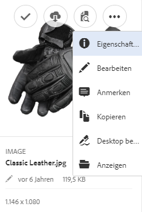
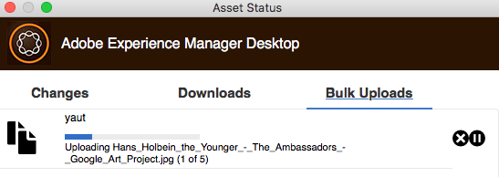

# Verwenden des [!DNL Experience Manager]-Desktop-Programms, v1.10 {#use-aem-desktop-app-v1x}

Mithilfe des Desktop-Programms haben Sie über Ihren lokalen Desktop problemlosen Zugriff auf die Assets in [!DNL Experience Manager] und die Assets können in beliebigen Desktop-Programmen verwendet werden. Assets können in Mac Finder oder Windows Explorer leicht angezeigt, in Desktop-Programmen geöffnet und lokal geändert werden. Die Änderungen werden dann wieder unter einer neuen, im Repository erstellten Version in [!DNL Experience Manager] gespeichert.

Diese Integration ermöglicht eine zentralisierte Asset-Verwaltung und den Zugriff über Creative Cloud und andere Anwendungen hinweg und gewährleistet so die Einhaltung von Branding- und anderen Standards.

Die wichtigsten Aufgaben, die Sie mit dem [!DNL Experience Manager] Das -Desktop-Programm v1 umfasst:

1. [Verbindung zu einem  [!DNL Experience Manager] -Server herstellen](#installandconnect)
1. [Assets direkt im Desktop-Programm öffnen](#openondesktop)
1. [Bearbeiten und Auschecken von Assets über das Desktop-Programm](#workonassets)
1. [Assets und Ordner stapelweise hochladen](#bulkupload)

Informationen zu den empfohlenen und nicht empfohlenen Aktionen finden Sie im Abschnitt [Best Practices für die Verwendung des Desktop-Programms](best-practices-for-v1.md). Wenn Sie bei der Verwendung der App Probleme haben, finden Sie weitere Informationen unter [Fehlerbehebung [!DNL Experience Manager] Desktop-Programm](troubleshoot-app-v1.md).

>[!NOTE]
>
>Das Desktop-Programm wurde in [!DNL Experience Manager]-Version 6.1 unter dem Namen [!DNL Experience Manager Assets Companion App] eingeführt.

## Touchpoints des [!DNL Experience Manager]-Desktop-Programms im kreativen Workflow {#aem-desktop-app-touch-points-in-the-creative-workflow}

Das [!DNL Experience Manager]-Desktop-Programm fügt sich zusammen mit [!DNL Assets] in Ihren kreativen Workflow ein und bietet die folgenden Touchpoints.

Touchpoints des ![[!DNL Experience Manager]-Desktop-Programms im kreativen Workflow](assets/aem_desktopapp_workflow.png)

Touchpoints des [!DNL Experience Manager]-Desktop-Programms im kreativen Workflow

## Installieren und Verbinden des Programms mit dem [!DNL Experience Manager] server {#installandconnect}

Bevor Sie mit der Erstellung oder Bearbeitung von Kreativ-Assets beginnen können, verbinden Sie zunächst das Desktop-Programm mit dem [!DNL Assets]-Server, damit Sie Assets in das Repository hochladen bzw. von dort herunterladen können. Führen Sie die folgenden Aufgaben durch:

1. [Installieren Sie das Programm](#installapp).
1. [Legen Sie Ihre Voreinstellungen](#inapppref) und Verbindungsdetails fest.
1. [Stellen Sie eine Verbindung zu einem [!DNL Experience Manager] -Server her](#connect) und stellen Sie das Asset-Repository als lokales Laufwerk bereit.
1. [Aktivieren von Desktop-Aktionen](#desktopactions) auf [!DNL Experience Manager] Server.

Die [!DNL Experience Manager] Das -Desktop-Programm verwendet eine HTTPS-Verbindung, um eine Verbindung zum [!DNL Experience Manager] Server verwenden, um Ihre Assets sicher und zuverlässig zu übertragen.

>[!NOTE]
>
>Bei allen oder einem Teil der Installations- und Konfigurationsschritte benötigen Sie möglicherweise Hilfe von Ihrem [!DNL Experience Manager] Administrator oder Systemadministrator.

### Installieren des Programms {#installapp}

Stellen Sie sicher, dass das Programm Ihre Version des Experience Manager-Servers für die Verwendung des Experience Manager-Desktop-Programms unterstützt. Laden Sie die entsprechende Installationsdatei (binär) für Ihr Betriebssystem (Mac oder Windows) herunter und installieren Sie das Programm.

Je nach Netzwerk- und Systemvoreinstellungen kann eine detaillierte Konfiguration erforderlich sein. Weitere Details finden Sie unter [Installieren und Konfigurieren des [!DNL Experience Manager] -Desktop-Programms](install-configure-app-v1.md).

1. Öffnen Sie die Download-Seite des [[!DNL Experience Manager] -Desktop-Programms, Version 1.10](/help/using/release-notes-of-v1.md) und laden Sie die entsprechende Binärdatei für Ihr Betriebssystem herunter.
1. Starten Sie die heruntergeladene Installationsdatei und befolgen Sie die Bildschirmanweisungen, um das Programm zu installieren.

   >[!NOTE]
   >
   >Es kann immer nur eine Instanz des [!DNL Experience Manager]-Desktop-Programms installiert und aktiv sein.

### Grundlegendes zu den Optionen und Voreinstellungen des Programms {#inapppref}

Das Programm ermöglicht Einstellungen zum Verbinden und Trennen von [!DNL Experience Manager] -Servern den Status von Uploads anzeigen, lokalen Cache verwalten usw. Typische Benutzer des Programms können die Standardeinstellungen verwenden. Sie können die Einstellungen anpassen, um die Anwendung optimal zu nutzen. Und nutzen Sie die Integration mit dem [!DNL Experience Manager] Server. Im Folgenden finden Sie die verschiedenen Einstellungen:

**Assets durchsuchen** Öffnen Sie das lokale Laufwerk, auf dem das [!DNL Assets]-Repository bereitgestellt wurde. Durchsuchen Sie also die Assets, die Ihnen nun auf Ihrem lokalen Computer zur Verfügung stehen.

**Asset-Status einsehen** Wenn geänderte Assets hochgeladen oder dem [!DNL Assets]-Repository neue Assets hinzugefügt werden, lädt das Programm die Assets im Hintergrund hoch. Der Upload im Hintergrund ermöglicht die reibungslose Ausführung von Vorgängen, ohne dass der Abschluss des Uploads abgewartet werden muss. Dies ist insbesondere bei umfangreichen Assets hilfreich. Sie können die Änderungen lokal speichern und müssen sich nicht mehr darum kümmern. Je nach verfügbarer Bandbreite nimmt das Senden dieser Assets an den Server durch das Programm etwas Zeit in Anspruch. Sie können den Status des Uploads sowie weitere grundlegende Informationen überprüfen.

**Optionen** Klicken Sie in der Ablage des Desktop-Programms auf Optionen , um festzulegen, dass das Programm beim Start gestartet wird, und verbinden Sie es mit dem [!DNL Experience Manager] Server beim Start und ändern Sie den Buchstaben des lokalen Laufwerks für [!DNL Assets] nach der Montage.

**Erweitert > Verwalten des Cache** Sie können festlegen, wie viel Festplattenspeicher für lokale Caching-Zwecke zur Verfügung gestellt wird. Die Artefakte vom [!DNL Assets]-Server werden für ein reibungsloseres Erlebnis lokal zwischengespeichert. Sie können die Standardeinstellungen Ihren Anforderungen entsprechend anpassen. Außerdem können Sie den Cache löschen, um alle Assets erneut abzurufen. Wenn Sie den Cache löschen, werden nicht gespeicherte Änderungen beibehalten. Alle Assets, die nicht in der [!DNL Experience Manager] -Server beibehalten und nicht gelöscht werden.

### Herstellen einer Verbindung zu einem [!DNL Experience Manager]-Server {#connect}

Das Programm unterstützt die Proxy-Konfiguration unter Mac und Windows. Die Konfiguration wird gelesen, wenn das Programm gestartet wird. Wenn Sie die Proxy-Einstellungen ändern, müssen Sie das Programm neu starten, damit die Änderungen übernommen werden.

>[!NOTE]
>
>Wenn Sie die Proxy-Einstellungen ändern, müssen Sie das Programm neu starten, damit die Änderungen übernommen werden. Andernfalls verwendet das Programm weiterhin den zuvor konfigurierten Proxyserver.

1. Starten Sie die [!DNL Experience Manager] Desktop-Programm. Wenn Sie Ihre [!DNL Experience Manager]-Instanz dem Programm zuordnen möchten, geben Sie Ihren [!DNL Experience Manager]-Server im folgenden Format an: `https://[aem-server-url]:[port]`.

   ![Auf einem Mac authentifizieren und [!DNL Experience Manager]-Server-URL angeben](assets/aem_desktop_app_server_url.png)

1. Geben Sie im Anmeldebildschirm den Benutzernamen und das Kennwort für Ihre Instanz an. Wenn Sie eine alternative [!DNL Experience Manager]-Instanz angeben möchten, wählen Sie die Option **[!UICONTROL Alternate Login URL]** aus.

   ![Anmeldedaten für den [!DNL Experience Manager]-Server auf dem Anmeldebildschirm des [!DNL Experience Manager]-Desktop-Programms angeben](assets/login_screen_v1.png)

### Aktivieren von Desktop-Aktionen in der Web-Oberfläche von [!DNL Experience Manager] {#desktopactions}

Über die Assets-Benutzeroberfläche können Sie zu den Asset-Speicherorten navigieren oder Assets auschecken und öffnen, um sie in Ihrem Desktop-Programm zu bearbeiten. Diese Optionen werden als Desktop-Aktionen bezeichnet und sind standardmäßig nicht aktiviert. Führen Sie die folgenden Schritte aus, um sie zu aktivieren.

1. Klicken/tippen Sie in der Assets-Benutzeroberfläche rechts oben in der Symtolleiste auf das Benutzersymbol.
1. Klicken Sie auf **[!UICONTROL My Preferences]**, um das Dialogfeld **[!UICONTROL Preferences]** anzuzeigen.

   ![[!DNL Experience Manager]-Oberfläche mit Benutzereinstellungen](assets/aem_ui_user_preferences.png)

1. Wählen Sie im Dialogfeld [!UICONTROL User Preferences] die Option **[!UICONTROL Show Desktop Actions For Assets]** und klicken Sie dann auf **[!UICONTROL Accept]**.

   ![Aktivieren von [!UICONTROL Show Desktop Actions For Assets], um Desktop-Aktionen zu aktivieren](assets/enable_desktop_actions.png)

   *Abbildung: Aktivieren von [!UICONTROL Show Desktop Actions For Assets], um Desktop-Aktionen zu aktivieren*

## Zugreifen auf und Öffnen von Assets über den Desktop {#openondesktop}

Wenn Sie auf **Öffnen** Um ein Asset auf Ihrem lokalen Computer zu öffnen, lädt das Programm das Asset in seinen internen Cache herunter. Das Programm startet das native Desktop-Programm, das dem Dateityp des heruntergeladenen Assets zugeordnet ist.

Wählen Sie in Mac **Öffnen** über das Kontextmenü, um ein Asset über das [!DNL Experience Manager] Desktop-Programm. Wählen Sie unter Windows im Kontextmenü die Option „Open on Web“ (Im Web öffnen) aus, um das Asset zu öffnen. Klicken Sie im Fenster „Asset Status“ (Asset-Status) auf das Symbol , bzw. tippen Sie darauf, um das Asset zu öffnen.

Wählen Sie bei Adobe InDesign-Dateien (INDD) im Kontextmenü die Option **[!UICONTROL Open]** aus. Wenn Sie auf diese Option klicken, lädt das Programm die verknüpften Assets in Ihr lokales Dateisystem herunter und öffnet anschließend die INDD-Datei in Adobe InDesign. Mithilfe dieser Methode wird sichergestellt, dass die erforderlichen Assets beim Bearbeiten einer INDD-Datei lokal verfügbar sind.

![Kontextmenüoptionen zum Zugreifen auf und Öffnen von Assets mithilfe des [!DNL Experience Manager]-Desktop-Programms](assets/aem_desktopapp_mac_context_menu.png)

*Abbildung: Kontextmenüoptionen zum Zugreifen auf und Öffnen von Assets mithilfe der [!DNL Experience Manager] Desktop-Programm.*

>[!NOTE]
>
>Adobe empfiehlt in den Finder-Darstellungsoptionen auf dem Mac die Optionen **Objektinfo einblenden**, **Objektvorschau einblenden** und **Vorschau einblenden** für den gemounteten [!DNL Assets]-Ordner zu aktivieren. Dadurch wird die Leistung verbessert.

### Zusätzliche Optionen in der [!DNL Experience Manager]-Benutzeroberfläche {#additional-options-in-aem-assets}

Nachdem Sie Ihrem lokalen Laufwerk das [!DNL Assets]-Repository zugeordnet haben, können Sie zusätzliche Symbole sowie die Funktion „Ordner-Upload“ aktivieren, die für zugeordnete Assets und Ordner angezeigt werden.

1. Öffnen Sie die Benutzeroberfläche von [!DNL Assets] und bewegen Sie den Mauszeiger auf einen Ordner oder ein Asset, um die Desktop-Aktionen in der Kartenansicht in Form von Schnellaktionen anzuzeigen.

   

   *Abbildung: Schnellaktionsmenü in der Assets-Benutzeroberfläche öffnen, um Desktop-Aktionen anzuzeigen.*

   Sie können auch auf diese Desktop-Aktionen zugreifen, indem Sie in der Symbolleiste auf die Option **Desktop-Aktionen** klicken, nachdem Sie das Asset ausgewählt haben. Eine weitere Möglichkeit bietet die Symbolleiste auf der Asset-Seite.

1. Wenn Sie das Asset im Desktop-Programm öffnen möchten, das der jeweiligen Dateierweiterung zugeordnet ist, klicken Sie auf die Schnellaktion **Auf dem Desktop öffnen** .

   Alternativ können Sie die Option **Öffnen** über das Menü **Desktop-Aktionen** in der Symbolleiste auswählen.

Um das gewünschte Asset in Ihrem lokalen Dateisystem zu finden, klicken Sie auf die Schnellaktion **Anzeigen** . Alternativ können Sie die Option **Anzeigen** über das Menü **Desktop-Aktionen** in der Symbolleiste auswählen.

## Grundlegendes zu den Asset-Status {#understand-the-asset-statuses}

|  | Das Programm ist mit dem Server verbunden und alle Assets werden synchronisiert. |
--- |--- |
|  | Die App wird gestartet, ist jedoch nicht mit dem Server verbunden. Bei einigen Assets steht möglicherweise die Synchronisierung aus. |
|  | Assets werden synchronisiert. Dateien werden hoch- oder herunterladen. Im Fenster „Asset Status“ (Asset-Status) können Sie den exakten Status anzeigen und die Übertragungen pausieren. |
|  | Das Programm versucht, eine erneute Verbindung herzustellen. Möglicherweise führen Netzwerkprobleme zur Trennung der Verbindung. |

## Bearbeiten von Assets {#workonassets}

### Auschecken von Assets in der [!DNL Experience Manager]-Web-Benutzeroberfläche {#check-out-assets-from-the-aem-web-interface}

Mit [!DNL Experience Manager Assets] können Sie Assets zum Bearbeiten auschecken und dann wieder einchecken, wenn Sie keine weiteren Änderungen vornehmen möchten. Wenn Sie ein Asset ausgecheckt haben, können nur Sie das Asset bearbeiten, mit Anmerkungen versehen, veröffentlichen, verschieben oder löschen. Durch das Auschecken eines Assets wird das Asset gesperrt und andere Benutzer können derartige Vorgänge nicht durchführen. Um Assets aus-/einchecken zu können, benötigen Sie entsprechenden Schreibzugriff.

Es gibt zwei Methoden zum Auschecken von Assets über die [!DNL Experience Manager]-Web-Benutzeroberfläche. Detaillierte Informationen zur ersten Methode finden Sie in der [Ein- und Auschecken von Dateien über die Assets-Benutzeroberfläche](https://experienceleague.adobe.com/en/docs/experience-manager-65/content/assets/managing/check-out-and-submit-assets). Führen Sie die folgenden Schritte aus, um das Asset anhand der zweiten Methode auszuchecken und zu öffnen, wenn die [!DNL Experience Manager] Das -Desktop-Programm ist installiert.

1. Öffnen Sie die Benutzeroberfläche von [!DNL Assets] und bewegen Sie den Mauszeiger auf einen Ordner oder ein Asset, um die Desktop-Aktionen in der Kartenansicht in Form von Schnellaktionen anzuzeigen.

   

   Sie können auch auf diese Desktop-Aktionen zugreifen, indem Sie in der Symbolleiste auf das Symbol „Desktop-Aktionen“ klicken/tippen, nachdem Sie das Asset ausgewählt haben. Eine weitere Möglichkeit bietet die Symbolleiste auf der Asset-Seite.

1. Klicken/tippen Sie zum Öffnen des Assets auf die Schnellaktion „Auf dem Desktop öffnen“ .

   Alternativ können Sie die Option „Öffnen“ über das Menü „Desktop-Aktionen“ in der Symbolleiste auswählen.

   >[!NOTE]
   >
   >Wenn Sie eine geöffnete, aber nicht ausgecheckte Datei bearbeiten, wissen andere Benutzer nicht, dass Sie das Asset aktualisieren.

1. Um ein Asset zur Bearbeitung in einer Adobe Creative Cloud-Anwendung zu öffnen, klicken Sie auf . Mit dieser Option wird auch das Asset zur Bearbeitung ausgecheckt. Checken Sie das Asset nach Abschluss der Bearbeitung ein, um die Änderungen in [!DNL Assets] zu aktualisieren.

   Alternativ können Sie die Option „Bearbeiten“ über das Menü „Desktop-Aktionen“ in der Symbolleiste auswählen.

1. Wählen Sie die Menüoption „Öffnen“ aus. Die ausgewählten Assets werden im Vorschaumodus geöffnet.
1. Um die Assets zu bearbeiten, wählen Sie die Option „Bearbeiten“ aus. Die Assets werden im Bearbeitungsmodus geöffnet.

### Auschecken von Assets aus Finder in macOS {#check-out-assets-on-mac}

Mit dem Programm können Sie Asset-Dateien auschecken, um zu verhindern, dass andere Benutzer die Dateien ändern, an denen Sie arbeiten.

1. Wählen Sie im Mac-Kontextmenü die Option AEM Assets-Ordner öffnen , um den Finder zu öffnen.

   ![Kontextmenüoptionen zum Zugreifen auf und Öffnen von Assets mithilfe des [!DNL Experience Manager]-Desktop-Programms](assets/aem_desktopapp_mac_context_menu.png)

   *Abbildung: Kontextmenüoptionen zum Zugreifen auf und Öffnen von Assets mithilfe der [!DNL Experience Manager] Desktop-Programm.*

1. Navigieren Sie zu dem Asset, das Sie auschecken möchten.
1. Klicken Sie mit der rechten Maustaste auf das Asset und wählen Sie im Kontextmenü die Option „More Assets Info“ (Weitere Asset-Informationen) aus.
1. Klicken/tippen Sie im Dialogfeld „Asset Info“ (Asset-Informationen) auf das Symbol „Auschecken“, um das Asset auszuchecken. Das Symbol „Auschecken“ wird zum Symbol „Einchecken“, nachdem Sie darauf geklickt/getippt haben.

   

1. Wenn Sie das Asset einchecken möchten, sodass es für andere Benutzer verfügbar ist, klicken/tippen Sie im Dialogfeld „Asset Info“ (Asset-Informationen) auf das Symbol „Einchecken“.

### Auschecken von Assets unter Windows {#check-out-assets-on-windows}

Mit dem Programm können Sie Asset-Dateien auschecken, um zu verhindern, dass andere Benutzer die Dateien ändern, an denen Sie arbeiten.

1. Wählen Sie im Kontextmenü die Option „Explore Assets“ (Assets durchsuchen), um Explorer zu öffnen.
1. Navigieren Sie in Explorer zum Speicherort des Assets, das Sie auschecken möchten.
1. Klicken Sie mit der rechten Maustaste auf das Asset und wählen Sie aus dem Kontextmenü die Option „Open on Web“ (Im Web öffnen) aus.
1. Klicken Sie im Dialogfeld &quot;Asset Info&quot;(Asset-Informationen) auf das Symbol &quot;Auschecken&quot;. Das Symbol &quot;Auschecken&quot;wird zum Symbol &quot;Einchecken&quot;.

   

1. Prüfen Sie das Asset in Explorer. Das Sperrsymbol auf dem Asset  gibt an, dass Sie das Asset ausgecheckt haben.

   >[!NOTE]
   >
   >Das Schlosssymbol wird möglicherweise mit einiger Verzögerung angezeigt. Die [!DNL Experience Manager] Das -Desktop-Programm speichert die Assets für einen schnellen Zugriff zwischen. Daher kann es einen Moment dauern, bis der Sperrstatus aktualisiert wird.

1. Wenn Sie das Asset einchecken möchten, sodass es für andere Benutzer verfügbar ist, klicken/tippen Sie im Dialogfeld **Asset Info** (Asset-Informationen) auf das Symbol „Einchecken“.

### Einchecken eines Assets mit Finder oder Explorer und der Web-Benutzeroberfläche {#check-in-an-asset-using-finder-or-explorer-and-using-web-interface}

Wenn Sie mit dem Bearbeiten der Assets fertig sind, speichern Sie sie in Ihrem Desktop-Programm. Wählen Sie im Kontextmenü die Option **Weitere Asset-Informationen** aus und klicken/tippen Sie auf „Einchecken“.

Die Assets werden in die [!DNL Experience Manager] Server. Optional können Sie den Status des Uploads überprüfen, indem Sie unter dem Ablagesymbol die Option **Asset-Status anzeigen** auswählen. Alternativ können Sie ein Asset über die [!DNL Experience Manager]-Web-Benutzeroberfläche einchecken. Klicken Sie auf die ausgecheckten Assets oder wählen Sie sie aus. Klicken Sie in der Symbolleiste auf das Symbol Einchecken .

Ein Asset wird automatisch in [!DNL Experience Manager] hochgeladen, nachdem die Änderungen lokal gespeichert wurden. Durch das Einchecken wird das Asset anderen [!DNL Experience Manager]-Benutzern zur Bearbeitung zur Verfügung gestellt.

### Massen-Upload von Assets und Ordnern auf den [!DNL Experience Manager]-Server {#bulkupload}

Verwenden der [!DNL Experience Manager] -Desktop-Programm können Sie einen ganzen Ordner mit Assets aus Ihrem lokalen Dateiverzeichnis in hochladen. [!DNL Assets]. Auf diese Weise werden alle Assets innerhalb des Ordners gemeinsam hochgeladen und Sie müssen sie nicht einzeln hochladen.

1. Klicken/tippen Sie in der Assets-Benutzeroberfläche auf **Erstellen** Wählen Sie in der Symbolleiste und dann im Menü die Option **Ordner hochladen**.
1. Navigieren Sie zu dem Ordner, den Sie hochladen möchten, und wählen Sie ihn aus.
1. Klicken/tippen Sie auf „OK“. Im Dialogfeld „Asset Status“ (Asset-Status) wird der Status des Uploads angezeigt.

   

   Anzeigen des Status des Uploads im Fenster &quot;Asset Status&quot;

   >[!NOTE]
   >
   >Sie können den Upload manuell pausieren oder abbrechen, indem Sie auf das entsprechende Symbol klicken/tippen.

1. Wenn der Upload abgeschlossen ist, schließen Sie das Dialogfeld und navigieren Sie zur Assets-Benutzeroberfläche. Der hochgeladene Ordner wird in der Web-Benutzeroberfläche angezeigt.

Adobe rät vom Kopieren und Einfügen oder Ziehen einer größeren Anzahl von Dateien oder verschachtelten Ordnern aus dem lokalen Dateisystem in den Freigabebereich des Netzwerks ab. Das Programm kann den Upload-Vorgang aufgrund technischer Einschränkungen nicht steuern und die Leistung ist schlecht.

Alternativ können Sie Dateien/Ordner in Finder oder Explorer auswählen, sie kopieren, zum Zielordner im Freigabebereich des Netzwerks navigieren und die Option auswählen. **Assets einfügen** aus dem [!DNL Experience Manager] Kontextmenü des Desktop-Programms. Auf diese Weise wird die [!DNL Experience Manager] Das -Desktop-Programm beginnt mit dem Hochladen der eingefügten Assets, die dem **Ordner hochladen** -Option verfügbar im [!DNL Experience Manager] Web-Schnittstelle.

>[!MORELIKETHIS]
>
>* [Fehlerbehebung für das [!DNL Experience Manager] -Desktop-Programm](troubleshoot-app-v1.md)
