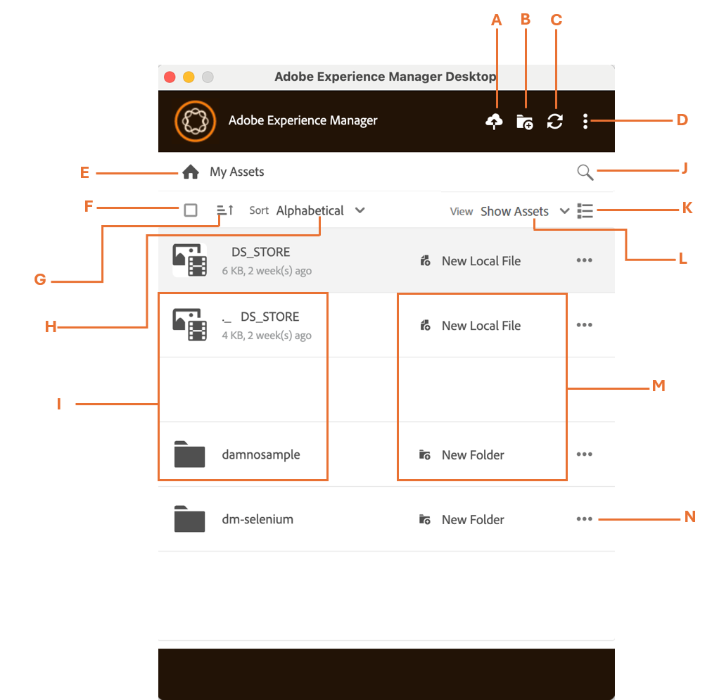

# Benutzeroberfläche des [!DNL Adobe Experience Manager]-Desktop-Programms {#user-interface-desktop-app}

[!DNL Adobe Experience Manager] Desktop-Programm bietet eine intuitive und benutzerfreundliche Benutzeroberfläche. Die klare Benutzeroberfläche erleichtert das Auffinden und Speichern von Assets und zugehörigen Informationen.

Wenn Sie sich bei [!DNL Adobe Experience Manager] Desktop-Programm anmelden, sehen Sie die folgende Oberfläche:

<table border="0">
    <tr>
        <td> A </td>
        <td> Hinzufügen von Assets </td>
    </tr>
    <tr>
        <td> B </td>
        <td> Verzeichnis oder Ordner erstellen </td>
    </tr>
    <tr>
        <td> C </td>
        <td> Aktualisieren oder Wiederherstellen der Verbindung von Assets </td>
    </tr>
    <tr>
        <td> D </td>
        <td> Weitere Optionen, wie:
            <ul>
                <li>Voreinstellungen</li>
                <li>Im Web öffnen</li>
                <li>Cookies löschen</li>
                <li>Arbeitsordner anzeigen</li>
                <li>Hilfe</li>
                <li>Abmelden</li>
                <li>Beenden</li>
            </ul>
        </td>
    </tr>
    <tr>
        <td> E </td>
        <td> Meine Assets (zeigt die App-Startseite an) </td>
    </tr>
    <tr>
        <td> F </td>
        <td> Alle Kontrollkästchen auswählen </td>
    </tr>
    <tr>
        <td> G </td>
        <td> Sortieren nach auf- oder absteigender Reihenfolge </td>
    </tr>
    <tr>
        <td> H </td>
        <td> Sortieren nach Alphabetisch, Größe oder Zuletzt geändert </td>
    </tr>
    <tr>
        <td> I </td>
        <td> 
        <ul>
            <li> <b>Dateioptionen:</b> Datei öffnen oder Datei hochladen </li> 
            <li> <b>Ordneroptionen: Ordner </b> </li>
        </ul>
        </td>
    </tr>
    <tr>
        <td> J </td>
        <td> Suchen von Assets </td>
    </tr>
    <tr>
        <td> K </td>
        <td> 
            <ul>
                <li> <b> Baumansicht: </b> Die Baumansicht zeigt scrollbare Dateien und Ordner in einer Spalte an. </li> 
                <li> <b> Rasteransicht: </b> Die Rasteransicht zeigt scrollbare Dateien und Ordner in einem Raster aus Zeilen und Spalten an. </li>
                <li> <b>: </b> Eine Kartenansicht ist ein kompaktes, begrenztes Layout, das Inhalte in einen sauberen und anklickbaren Block organisiert. </li> 
            </ul>
        </td>
    </tr>
    <tr>
        <td> L </td>
        <td> Anzeigeoptionen wie: 
            <ul>
                <li><b> Assets anzeigen</b> Ermöglicht das Anzeigen aller Assets. </li>
                <li><b> Sammlungen anzeigen</b> Ermöglicht es Ihnen, alle in der nativen AEM-Anwendung erstellten Sammlungen anzuzeigen. Weitere Sammlungen anzeigen. </li>
                <li><b> Lokal bearbeiten</b> Ermöglicht die Anzeige aller lokal geänderten Assets. In dieser Ansicht können Sie mehrere Assets hinzufügen und hochladen.</li>
                <li><b> Asset-Übertragungen</b> Ermöglicht die Anzeige aller Assets, die von der nativen Mobile App an die lokale übertragen werden oder umgekehrt. </li>
                <li>Angeheftete Elemente <b>: </b> Sie alle angehefteten Elemente anzeigen.</li>
            </ul>
        </td>
    </tr>
    <tr>
        <td> M </td>
        <td> Anzeige für Datei oder Ordner (lokal oder Web). </td>
    </tr>
    <tr>
        <td> N </td>
        <td> Weitere Optionen: 
            <ul>
                <li><b> Download</b> Ermöglicht das Herunterladen eines ausgewählten Assets oder Ordners. </li>
                <li><b> Kopie herunterladen</b> Ermöglicht das Herunterladen einer Kopie eines ausgewählten Assets oder Ordners, die als Duplikat für die Offline-Verwendung gespeichert wurde. </li>
                <li><b> Ordner einblenden</b> Verwenden Sie diese Option, um den Ordner im Datei-Explorer Ihres Systems zu öffnen.</li>
                <li><b> Pin</b> Ermöglicht das Anheften oder Entfernen des ausgewählten Assets. </li>
                <li><b> Ordner-Metadatenschema anwenden</b> Verwenden Sie diese Option, um ein strukturiertes Metadatenschema anzuwenden, mit dem Assets konsistent organisiert, durchsucht und verwaltet werden können.</li>
                <li><b> Ordnereigenschaften anzeigen: </b> Es werden detaillierte Metadaten und Attribute angezeigt, die mit einem Ordner verknüpft sind. </li>
                <li><b> Im Web öffnen : </b> Sie auf den Ordner zu und zeigen Sie ihn direkt über eine Webbrowser-Oberfläche an. </li>
                <li><b>: </b> Entfernt das ausgewählte Asset und seinen Inhalt. </li>
                <li><b> Umbenennen: </b> Ändert den Namen des ausgewählten Assets in einen neuen benutzerdefinierten Namen </li>
            </ul>
        </td>
    </tr>
</table>

## Anzeigen der Ordnerstruktur [!DNL Adobe Experience Manager] Desktop-Programm {#folder-structure-desktop-app}

Navigieren Sie zu einem Ordner und klicken Sie auf  neben dem Ordnernamen. Wählen Sie **[!UICONTROL Reveal Folder]** aus, um den Ordner sofort im Datei-Explorer Ihres Systems zu öffnen, sodass Sie schnell und direkt auf seinen Inhalt zugreifen können, um die Navigation und Verwaltung zu erleichtern.

## Nächste Schritte {#next-steps}

* [Video zu den ersten Schritten mit dem Adobe Experience Manager Desktop-Programm ansehen](https://experienceleague.adobe.com/de/docs/experience-manager-learn/assets/creative-workflows/aem-desktop-app)

* Geben Sie Feedback zur Dokumentation über [!UICONTROL Edit this page] ) oder [!UICONTROL Log an issue]  in der rechten Seitenleiste

* Kontaktieren Sie die [Kundenunterstützung](https://experienceleague.adobe.com/de?support-solution=General#support)

>[!MORELIKETHIS]
>
>* [Verwalten von Assets im Desktop-Programm](/help/using/assets-management-tasks.md)
>* [Herunterladen von Assets](/help/using/download-assets.md)
>* [Hochladen von Assets](/help/using/upload-assets.md)
