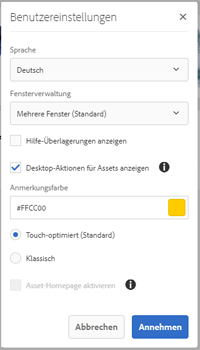
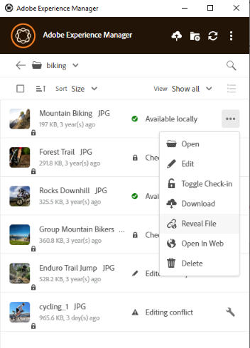

# Verwenden des [!DNL Adobe Experience Manager]-Desktop-Programms {#use-aem-desktop-app-v2}

Verwenden Sie die [!DNL Adobe Experience Manager] Desktop-Programm für den Zugriff auf digitale Assets, die in einem [!DNL Adobe Experience Manager] DAM-Repository auf Ihrem lokalen Desktop. Sie können diese Assets dann in allen Desktop-Applikationen verwenden. Sie können die Assets lokal in Desktop-Applikationen öffnen und bearbeiten. Laden Sie die Änderungen erneut in [!DNL Experience Manager] mit Versionskontrolle, um Updates für andere Benutzer freizugeben. Sie können auch neue Dateien und Ordnerhierarchien in [!DNL Experience Manager] hochladen, Ordner erstellen und Assets oder Dateien aus dem [!DNL Experience Manager]-DAM löschen.

Die Integration ermöglicht es verschiedenen Rollen in der Organisation, die Assets zentral in [!DNL Experience Manager Assets] und um auf die Assets auf dem lokalen Desktop in den nativen Programmen unter Windows oder macOS zuzugreifen.

Wenn Sie das Programm nach dem Abmelden oder zum ersten Mal öffnen, müssen Sie die URL des [!DNL Experience Manager]-Servers im Format `https://[aem-server-url]:[port]/` angeben. Wählen Sie dann die Option [!UICONTROL Connect] aus. Geben Sie Ihre Anmeldeinformationen ein, um das Programm mit dem Server zu verbinden.

Die wichtigsten Aufgaben, die Sie mit dem [!DNL Adobe Experience Manager] Desktop-Programm:

![Workflows und Aufgaben, die Sie mit der Desktop-App von [!DNL Experience Manager] erledigen können](assets/aem_desktop_app_usecases_v2.png "Workflows und Aufgaben, die Sie mit der Desktop-App von [!DNL Adobe Experience Manager]  erledigen können")

Laden Sie [diese](assets/aem_desktop_app_usecases_print.pdf) druckfertige PDF-Datei herunter.

## Funktionsweise des Desktop-Programms {#how-app-works2}

Bevor Sie mit der Verwendung des Programms beginnen, sollten Sie [Funktionsweise der App](release-notes.md#how-app-works). Machen Sie sich auch mit den folgenden Begriffen vertraut:

* **[!UICONTROL Desktop Actions]**: Über die Assets-Web-Oberfläche können Sie in einem Browser zu den Asset-Speicherorten navigieren oder Assets auschecken und öffnen, um sie in Ihrem nativen Desktop-Programm zu bearbeiten. Diese Aktionen sind über die Web-Oberfläche verfügbar und verwenden die Funktionalität des Desktop-Programms. Erfahren Sie, [wie Sie Desktop-Aktionen aktivieren](using.md#desktopactions-v2).

* Dateistatus **[!UICONTROL Cloud Only]**: Solche Assets werden nicht auf den lokalen Computer heruntergeladen und stehen nur auf dem [!DNL Experience Manager]-Server zur Verfügung.

* Dateistatus **[!UICONTROL Available locally]**: Die Assets werden wie bisher heruntergeladen und stehen auf dem lokalen Computer zur Verfügung. Die Assets werden nicht geändert.

* Dateistatus **[!UICONTROL Edited locally]**: Diese Assets werden lokal geändert und die Änderungen bleiben beim Hochladen auf den [!DNL Experience Manager]-Server erhalten. Nach dem Hochladen ändert sich der Status in [!UICONTROL Available locally]. Siehe [Bearbeiten von Assets](using.md#edit-assets-upload-updated-assets).

* Dateistatus **[!UICONTROL Editing conflict]**: Wenn Sie und andere Assets gleichzeitig bearbeiten, zeigt das Programm an, dass ein Bearbeitungskonflikt aufgetreten ist. Das Programm bietet außerdem Optionen zum Beibehalten oder Verwerfen Ihrer Änderungen. Erfahren Sie, [wie Sie Bearbeitungskonflikte vermeiden](using.md#adv-workflow-collaborate-avoid-conflicts).

* Dateistatus **[!UICONTROL Modified remotely]**: das Programm zeigt an, ob ein Asset, das Sie heruntergeladen haben, auf dem [!DNL Experience Manager]-Server geändert wurde. Das Programm bietet auch die Möglichkeit, die neueste Version herunterzuladen und Ihre lokale Kopie zu aktualisieren. Erfahren Sie, [wie Sie Bearbeitungskonflikte vermeiden](using.md#adv-workflow-collaborate-avoid-conflicts).

* **[!UICONTROL Check-out]**: Wenn Sie eine Datei bearbeiten oder eine Datei bearbeiten möchten, können Sie den Status „Auschecken“ aktivieren. Dadurch wird dem Asset im Programm ein Sperrsymbol hinzugefügt und [!DNL Experience Manager] Webschnittstelle. Das Sperrsymbol zeigt anderen Benutzern an, dass sie dasselbe Asset nicht gleichzeitig bearbeiten sollen, da dies zu einem Bearbeitungskonflikt führt.

* **[!UICONTROL Check-in]**: Markieren Sie das Asset als sicher, damit andere Benutzer es bearbeiten können, ohne dass ein Bearbeitungskonflikt entsteht. Wenn Sie Ihre Änderungen hochladen, wird das Sperrsymbol automatisch entfernt. Durch das Umschalten des Eincheckstatus wird auch das Sperrsymbol entfernt. Adobe empfiehlt jedoch, das manuelle Einchecken zu vermeiden, ohne die Änderungen hochzuladen. Wenn Sie Ihre Änderungen verwerfen, können Sie den Status „Einchecken“ manuell deaktivieren.

* Aktion **[!UICONTROL Open]**: Öffnen Sie einfach das Asset zur Vorschau im nativen Programm. Adobe empfiehlt, dass Sie die Bearbeitung des Assets mit dieser Aktion vermeiden. Der Grund dafür ist, dass das Asset nicht ausgecheckt wird. In der Zwischenzeit können andere Benutzer Bearbeitungen vornehmen, die zu Bearbeitungskonflikten führen.

* Aktion **[!UICONTROL Edit]**: Verwenden Sie die Aktion, um das Bild zu ändern. Klicken [!UICONTROL Edit] checkt das Asset aus und fügt ein Sperrsymbol zum Asset hinzu. Wenn Sie nach dem Klicken auf „Edit“ (Bearbeiten) das Asset nicht bearbeiten möchten, klicken Sie auf [!UICONTROL Toggle check-in]. So können Sie Assets im [!DNL Experience Manager] DAM-Ordnerhierarchie verwenden Sie die [!DNL Experience Manager] Aktionen auf der Web-Oberfläche und nicht die Bearbeitungsaktion.

* Aktion **[!UICONTROL Download]**: Laden Sie das Asset auf Ihren lokalen Computer herunter. Sie können die Assets jetzt herunterladen und später bearbeiten. Arbeiten Sie offline und laden Sie die Änderungen später hoch. Assets werden in einen Cache-Ordner auf Ihrem Dateisystem heruntergeladen.

* **[!UICONTROL Reveal File]** oder **[!UICONTROL Reveal Folder]** Aktion : Während die Assets in einen lokalen Cache-Ordner heruntergeladen werden, imitiert das Programm ein lokales Netzwerklaufwerk. Es wird ein lokaler Pfad für jedes Asset bereitgestellt. Um diesen Pfad zu ermitteln, verwenden Sie die entsprechende Einblendeoption im Programm. Zum Platzieren von Assets im Creative Cloud-Programm ist die Aktion „Reveal“ (Anzeigen) erforderlich. Siehe [Platzieren von Assets](using.md#place-assets-in-native-documents).

* **[!UICONTROL Open In Web]** Aktion : Zum Anzeigen des Assets im [!DNL Experience Manager] Webschnittstelle, öffnen Sie sie im Web. Sie können weitere Workflows über die [!DNL Experience Manager] -Benutzeroberfläche, z. B. zum Aktualisieren von Metadaten oder zur Asset-Erkennung.

* Aktion **[!UICONTROL Delete]**: Löschen Sie das Asset aus dem [!DNL Experience Manager]-DAM-Repository. Durch die Aktion wird die Originalkopie des Assets auf dem Experience Manager-Server gelöscht. Wenn Sie nur Änderungen am lokalen Asset verwerfen möchten, lesen Sie [Änderungen verwerfen](using.md#edit-assets-upload-updated-assets).

* **[!UICONTROL Upload Changes]**: Das Desktop-Programm lädt das aktualisierte Asset nur hoch, wenn Sie es explizit in den [!DNL Experience Manager] Server. Wenn Sie Ihre Änderungen speichern, werden diese nur auf Ihrem lokalen Computer gespeichert. Beim Hochladen wird das Asset automatisch eingecheckt und das Sperrsymbol entfernt. Siehe [Bearbeiten von Assets](using.md#edit-assets-upload-updated-assets).

## Aktivieren von Desktop-Aktionen in [!DNL Experience Manager] Webschnittstelle {#desktopactions-v2}

Über die [!DNL Assets]-Benutzeroberfläche in einem Browser können Sie zu den Asset-Speicherorten navigieren oder das Asset auschecken und öffnen, um es im Desktop-Programm zu bearbeiten. Diese Optionen werden als [!UICONTROL Desktop Actions] bezeichnet und sind standardmäßig nicht aktiviert. Gehen Sie zur Aktivierung wie folgt vor.

1. Klicken Sie in der [!DNL Assets]-Konsole in der Symbolleiste auf das Symbol **[!UICONTROL User]**.
1. Klicken Sie auf **[!UICONTROL My Preferences]**, um das Dialogfeld **[!UICONTROL Preferences]** anzuzeigen.

1. Wählen Sie im Dialogfeld [!UICONTROL User Preferences] die Option **[!UICONTROL Show Desktop Actions For Assets]** und klicken Sie dann auf **[!UICONTROL Accept]**.

   

   *Abbildung: Auswählen [!UICONTROL Show Desktop Actions For Assets] , um Desktop-Aktionen zu aktivieren.*

## Durchsuchen, Suchen und Anzeigen einer Vorschau von Assets {#browse-search-preview-assets}

Sie können die im [!DNL Experience Manager]-Repository verfügbaren Assets vom Desktop-Programm aus durchsuchen, suchen und in der Vorschau anzeigen. Versuchen Sie Folgendes im Programm:

1. Navigieren Sie zu einem Ordner und sehen Sie einige grundlegende Informationen zu den im Ordner verfügbaren Assets sowie kleine Miniaturen aller Assets.

   

1. Um weitere Informationen und eine größere Miniaturansicht eines einzelnen Assets anzuzeigen, klicken Sie auf den Dateinamen.

   

1. Klicken Sie auf **[!UICONTROL Open]** oder **[!UICONTROL Edit]**, um die Datei lokal herunterzuladen und sie im nativen Programm anzuzeigen oder zu bearbeiten.
1. Suchen Sie mithilfe von Keywords nach einem zugehörigen Asset im [!DNL Experience Manager]-Repository. Verwenden Sie `?` und `*` als Platzhalter. Diese Platzhalter ersetzen ein einzelnes oder mehrere Zeichen. Filtern und sortieren Sie die Ergebnisse nach Bedarf.

   

   

>[!NOTE]
>
>Die App zeigt die Assets an, indem sie die Suchkriterien über mehrere Metadatenfelder hinweg und nicht nur den Titel oder Dateinamen des Assets abgleicht.

## Herunterladen von Assets {#download-assets}

Sie können die Assets auf Ihr lokales Dateisystem herunterladen. Das Programm ruft die Assets aus der [!DNL Experience Manager] und speichert dieselbe Kopie auf Ihrem lokalen Dateisystem.

Klicken Sie für Optionen auf das Symbol  und dann zum Herunterladen auf das Symbol .

>[!NOTE]
>
>Beim Herunterladen oder Hochladen einer oder mehrerer Dateien deaktiviert das Programm die Aktionen für Assets und Ordner. Die Aktionen sind verfügbar, wenn der Download oder Upload abgeschlossen ist.

Das Herunterladen mehrerer Assets kann zu einer schlechten Leistung führen, wenn die Warteschlangengröße groß ist oder ein Netzwerkproblem vorliegt. Außerdem können Sie unwissentlich viele Assets zum Herunterladen in eine Warteschlange stellen, wenn Sie einen Ordner herunterladen. Um lange Wartezeiten zu vermeiden, beschränkt das Programm die Anzahl der Assets, die in einem Schritt heruntergeladen wurden. Informationen zum Konfigurieren finden Sie unter [Festlegen von Voreinstellungen](install-upgrade.md#set-preferences). Selbst unterhalb dieser Grenze kann das Programm manchmal eine Bestätigung abfragen, bevor ein scheinbar großer Ordner heruntergeladen wird.

Wenn Ordner ausgewählt und heruntergeladen werden, lädt das Programm nur Assets herunter, die direkt in den Ordnern unter [!DNL Experience Manager]. Assets werden nicht automatisch aus Unterordnern heruntergeladen.

## Öffnen von Assets auf Ihrem Desktop {#openondesktop-v2}

Sie können die Remote-Assets zur Ansicht im nativen Programm öffnen. Die Assets werden in einen lokalen Ordner heruntergeladen. Anschließend werden sie in der nativen Anwendung gestartet, die dem Dateiformat zugeordnet ist. Sie können das native Programm ändern, um bestimmte Dateitypen (Erweiterungen) auf Ihrem Mac- oder Windows-Computer zu öffnen.

Klicken Sie im Asset-Menü auf **[!UICONTROL Open]**. Das Asset wird lokal heruntergeladen und im nativen Programm geöffnet. Überprüfen Sie den Download-Status und die Übertragungsgeschwindigkeit großer Assets in der Statusleiste.

<!-- 
-->

>[!NOTE]
>
>Wenn die erwarteten Änderungen nicht im Programm übernommen werden, klicken Sie auf das Symbol „Aktualisieren“  oder klicken Sie mit der rechten Maustaste auf **[!UICONTROL Refresh]**. Die Aktionen sind nicht verfügbar, während größere Downloads oder Uploads ausgeführt werden.

Um den lokalen Download-Ordner eines Assets zu öffnen, klicken Sie auf das Symbol  und dann auf  **[!UICONTROL Reveal File]**.

## Verwenden oder Platzieren von Assets in nativen Dokumenten {#place-assets-in-native-documents}

In einigen Fällen, z. B. beim Platzieren eines Assets in einem nativen Dokument, greifen Sie in Windows Explorer oder Mac Finder auf eine Datei zu. Um zum Speicherort der lokal heruntergeladenen Datei im Dateisystem zu gelangen, verwenden Sie die Option  **[!UICONTROL Reveal File]**.

Klicks **[!UICONTROL Reveal File]** oder **[!UICONTROL Reveal Folder]** in einem Ordner, um Windows Explorer oder Mac Finder mit der auf Ihrem lokalen Computer vorab ausgewählten Datei- oder Ordnerauswahl zu öffnen. Beispielsweise ist die Option hilfreich, um die [!DNL Experience Manager] -Dateien in den nativen Programmen, die das Platzieren oder Verknüpfen lokaler Dateien unterstützen. Informationen zum Platzieren von Dateien in Adobe InDesign finden Sie unter [Platzieren von Grafiken](https://helpx.adobe.com/de/indesign/using/placing-graphics.html).

Die **[!UICONTROL Reveal File]** -Aktion eine lokale Netzwerkfreigabe öffnet. Es werden nur die lokal verfügbaren Assets angezeigt. Das heißt, es werden Assets angezeigt, die mit dem Programm veröffentlicht, heruntergeladen oder geöffnet/bearbeitet wurden. Die lokale Netzwerkfreigabe lädt keine Änderungen in [!DNL Experience Manager] hoch. Um die Änderungen hochzuladen, verwenden Sie explizit das **[!UICONTROL Upload Changes]** oder **[!UICONTROL Upload]** Aktionen in der App.

>[!NOTE]
>
>Zur Abwärtskompatibilität mit dem [!DNL Experience Manager]-Desktop-Programm v1.x werden die angezeigten Dateien von einer lokalen Netzwerkfreigabe bereitgestellt, wobei nur lokal verfügbare Dateien angezeigt werden. Die Desktop-Pfade der angezeigten Dateien sind mit den Pfaden identisch, die von der Programm-Version v1.x erstellt wurden.

>[!CAUTION]
>
>Verwenden Sie nicht das **[!UICONTROL Reveal File]** Option zum Bearbeiten von Assets in nativen Programmen. Verwenden Sie stattdessen die Aktionen **[!UICONTROL Edit]**. Weitere Informationen finden Sie unter [Erweiterter Workflow: Zusammenarbeit an denselben Dateien und Vermeidung von Bearbeitungskonflikten](#adv-workflow-collaborate-avoid-conflicts).

## Bearbeiten von Assets und Hochladen aktualisierter Assets in [!DNL Experience Manager] {#edit-assets-upload-updated-assets}

Öffnen Sie Assets zur Bearbeitung, wenn Sie Änderungen vornehmen und die aktualisierten Assets in die [!DNL Experience Manager] Server. Um Konflikte mit Bearbeitungen anderer Benutzer zu vermeiden, verwenden Sie das Programm, um eine Bearbeitungssitzung zu starten. Bevor Sie mit der Bearbeitung beginnen, stellen Sie sicher, dass das Asset kein Sperrsymbol enthält, das angibt, dass ein anderer Benutzer das Asset bearbeitet.

Um ein Asset zu bearbeiten, suchen Sie nach dem Asset oder navigieren Sie zum Speicherort des Assets. Klicken Sie auf  und dann auf **[!UICONTROL Edit]**.

Verwenden Sie **[!UICONTROL Toggle Check-out]** zum Sperren des Assets, um Konflikte mit Bearbeitungen anderer Benutzer in den beiden folgenden Situationen zu vermeiden:

* Sie haben begonnen, ein Asset zu bearbeiten, ohne es vorher auszuchecken (indem Sie es einfach öffnen).
* Sie möchten demnächst mit der Bearbeitung eines Assets beginnen und möchten nicht, dass andere Benutzer es bearbeiten.

Nachdem Sie die Bearbeitungen vorgenommen haben, zeigt die App den Status **[!UICONTROL Edited Locally]** für geänderte Assets an. Alle in den Assets gespeicherten Änderungen sind nur lokal verfügbar, bis Sie die Änderungen in [!DNL Experience Manager] hochladen. Um einzelne Assets oder einige Assets einzeln hochzuladen, klicken Sie in den Optionen für ein Asset auf **[!UICONTROL Upload Changes]**. Dadurch wird eine Version des Assets in [!DNL Experience Manager] erstellt. Verwenden der Web-Oberfläche von [!DNL Assets]können Sie den Asset-Verlauf im [Timeline-Ansicht](https://experienceleague.adobe.com/en/docs/experience-manager-65/content/assets/using/activity-stream).

Best Practices für die gemeinsame Bearbeitung finden Sie unter [Erweiterter Workflow: Zusammenarbeit an denselben Dateien und Vermeidung von Bearbeitungskonflikten](#adv-workflow-collaborate-avoid-conflicts).

In den folgenden Fällen möchten Sie Ihre Änderungen und Bearbeitungen am lokalen Asset vielleicht verwerfen. Klicken Sie auf **[!UICONTROL Discard Changes]**.

* Wenn Sie Ihre Änderungen nicht lokal speichern möchten in [!DNL Experience Manager].
* Sie nehmen Änderungen am ursprünglichen Asset vor, nachdem Sie einige Änderungen gespeichert haben.
* Sie beenden die Bearbeitung des Assets, da es nicht mehr benötigt wird.

Deaktivieren Sie ggf. das Auschecken. Das aktualisierte Asset wird aus dem lokalen Cache-Ordner entfernt und erneut heruntergeladen, wenn Sie es bearbeiten oder öffnen.

## Hochladen und Hinzufügen neuer Assets zu [!DNL Experience Manager] {#upload-and-add-new-assets-to-aem}

Benutzer können dem DAM-Repository neue Assets hinzufügen. Vielleicht sind Sie z. B. ein Agenturfotograf oder -auftragnehmer, der eine große Anzahl von Fotos aus einem Foto-Shooting zum [!DNL Experience Manager]-Repository hinzufügen möchte. Um [!DNL Experience Manager] neue Inhalte hinzuzufügen, wählen Sie  in der oberen Leiste des Programms aus. Navigieren Sie zu den Asset-Dateien im lokalen Dateisystem und klicken Sie auf **[!UICONTROL Select]**. Alternativ können Sie Assets hochladen, indem Sie die Dateien oder Ordner in die Benutzeroberfläche des Programms ziehen. Wenn Sie unter Windows Assets auf einen Ordner innerhalb des Programms ziehen, werden die Assets in den Ordner hochgeladen. Wenn das Hochladen länger dauert, zeigt das Programm eine Fortschrittsleiste an.

<!-- 
-->

Sie können Ordner oder einzelne Dateien aus Ihrem lokalen Dateisystem hochladen. Die Hierarchie eines Ordners wird beim Hochladen beibehalten. Bevor Sie Assets stapelweise hochladen, lesen Sie [Massen-Uploads](#bulk-upload-assets).

Um die Liste der in einer bestimmten Sitzung übertragenen Assets anzuzeigen, klicken Sie auf **[!UICONTROL View]** > **[!UICONTROL Assets transfers]**. Mit der Liste können Sie die Dateiübertragungen der aktuellen Sitzung anzeigen und schnell überprüfen.

Sie können die gleichzeitigen Uploads (Beschleunigung) mit der Einstellung **[!UICONTROL Preferences]** > **[!UICONTROL Upload acceleration]** steuern. Mehr gleichzeitige Uploads führen zu einer Beschleunigung des Upload-Vorgangs, können jedoch ressourcenintensiv sein und den Prozessor des lokalen Computers stärker auslasten. Wenn Ihr System nur langsam reagiert, starten Sie den Upload-Vorgang mit einer geringeren Anzahl gleichzeitiger Uploads neu.

>[!NOTE]
>
>Die Übertragungsliste ist nicht dauerhaft und steht nicht mehr zur Verfügung, wenn Sie das Programm verlassen und erneut öffnen.

### Verwalten von Sonderzeichen in Asset-Namen {#special-characters-in-filename}

Im alten Programm behielten die im Repository erstellten Knotennamen die Leerzeichen und die Groß- und Kleinschreibung der vom Benutzer angegebenen Ordnernamen bei. Damit das aktuelle Programm die Knotennamensregeln der Programmversion 1.10 emulieren kann, aktivieren Sie [!UICONTROL Use legacy conventions when creating nodes for assets and folders] unter [!UICONTROL Preferences]. Weitere Informationen finden Sie in den [Programmvoreinstellungen](/help/using/install-upgrade.md#set-preferences). Diese veraltete Voreinstellung ist standardmäßig deaktiviert.

>[!NOTE]
>
>Das Programm ändert nur die Knotennamen im Repository anhand der folgenden Namenskonventionen. Das Programm behält den `Title` des Assets unverändert bei.

<!-- TBD: Do NOT use this table.

| Where do characters occur | Characters | Legacy preference | Renaming convention | Example |
|---|---|---|---|---|
| In file name extension | `.` | Enabled or disabled | Retained as is | NA |
| File or folder name | `. / : [ ] | *` | Enabled or disabled | Replaced with a `-` (hyphen) | `myimage.jpg` remains as is and `my.image.jpg` changes to `my-image.jpg`. |
| Folder name | `% ; # , + ? ^ { } "` | Disabled | Replaced with a `-` (hyphen) | tbd |
| File name | `% # ? { } &` | Disabled | Replaced with a `-` (hyphen) | tbd |
| File name | Whitespaces | Enabled or disabled | Retained as is | NA |
| Folder name | Whitespaces | Disabled | Replaced with a `-` (hyphen) | tbd |
| File name | Uppercase characters | Disabled | Retained as is | tbd |
| Folder name | Uppercase characters | Disabled | Replaced with a `-` (hyphen) | tbd |
-->

| Zeichen ‡ | Alte Voreinstellung im Programm | Bei Auftreten in Dateinamen | Bei Auftreten in Ordnernamen | Beispiel |
|---|---|---|---|---|
| `. / : [ ] \| *` | Aktiviert oder deaktiviert | Ersetzt durch `-` (Bindestrich). Ein `.` (Punkt) in der Dateinamenerweiterung wird unverändert beibehalten. | Ersetzt durch `-` (Bindestrich). | `myimage.jpg` bleibt unverändert und `my.image.jpg` Änderungen in `my-image.jpg`. |
| `% ; # , + ? ^ { } "` und Leerzeichen |  Deaktiviert | Leerzeichen werden beibehalten | Ersetzt durch `-` (Bindestrich). | `My Folder.` ändert sich in `my-folder-`. |
| `# % { } ? & .` |  Deaktiviert | Ersetzt durch `-` (Bindestrich). | Nicht vorhanden. | `#My New File.` ändert sich in `-My New File-`. |
| Großbuchstaben |  Deaktiviert | Groß- und Kleinschreibung wird unverändert beibehalten. | In Kleinbuchstaben geändert. | `My New Folder` ändert sich in `my-new-folder`. |
| Großbuchstaben |  Aktiviert | Groß- und Kleinschreibung wird unverändert beibehalten. | Groß- und Kleinschreibung wird unverändert beibehalten. | Nicht vorhanden. |

‡ Die Liste der Zeichen ist eine durch Leerzeichen getrennte Liste.

<!-- TBD: Check if the following is to be included in the footnote.

Do not use &#92;&#92; in the names of files and &#92;&#116; &#38; in the names of folders. 
-->

<!-- TBD: Securing the below presentation of the same content in a comment.

**File names**

| Characters | Replaced by |
|---|---|
| &#35; &#37; &#123; &#63; &#125; &#38; &#46; &#47; &#58; &#91; &#124; &#93; &#42; | hyphen (-) |
| whitespaces | whitespaces are retained |
| capital case | casing is retained |

>[!CAUTION]
>
>Avoid using &#92;&#92; in file names.

**Folder names**

| Characters | Replaced by |
|---|---|
| Characters | Replaced by |
| &#37; &#59; &#35; &#44; &#43; &#63; &#94; &#123; &#123; &#34; &#46; &#47; &#59; &#91; &#93; &#124; &#42; | hyphen (-) |
| whitespaces | hyphen (-) |
| capital case | lower case |

>[!CAUTION]
>
>Avoid using &#92;&#92; &#92;&#116; &#38; in folder names.

>[!NOTE]
>
>If you enable [!UICONTROL Use legacy conventions when creating nodes for assets and folders] in app [!UICONTROL Preferences], then the app emulates v1.10 app behavior when uploading folders. In v1.10, the node names created in the repository respect spaces and casing of the folder names provided by the user. For more information, see [app Preferences](/help/using/install-upgrade.md#set-preferences).

-->

## Arbeiten mit mehreren Assets {#work-with-multiple-assets}

Benutzer können problemlos mit mehreren Assets arbeiten und diese verwalten, indem sie beispielsweise alle Bearbeitungen in einem Schritt hochladen oder verschachtelte Ordner mit wenigen Klicks hochladen.

### Durchsuchen großer Ordner {#browse-large-folders}

Wenn Sie mit Ordnern arbeiten, die viele Assets enthalten, führen Sie einen Bildlauf durch, um weitere Assets anzuzeigen. Um mit der Tastatur zu scrollen, drücken Sie einige Male die Registerkarte , um das Asset oben auszuwählen. Das jeweils ausgewählte Asset ist hervorgehoben. Verwenden Sie jetzt die Nach-unten-Taste, um durch die Asset-Liste zu navigieren.

### Schnellzugriff für ausgewählte Assets {#quick-actions-for-selected-assets}

Klicken Sie auf die Miniaturansicht einiger Assets, um die Assets auszuwählen. Um alle Assets auszuwählen, aktivieren Sie das Kontrollkästchen in der oberen Leiste des Programms. Die Aktionen, die für alle ausgewählten Assets gemeinsam gelten, werden in einer Symbolleiste am unteren Rand des Programms angezeigt.

Die in der Symbolleiste unten verfügbaren Aktionen hängen vom Status der ausgewählten Dateien ab. Wenn Sie beispielsweise nur Dateien mit dem Status **[!UICONTROL Edited Locally]** auswählen, wird das Symbol **[!UICONTROL Upload Changes]** angezeigt. Wenn Sie eine Mischung aus **[!UICONTROL Edited locally]** und **[!UICONTROL Cloud only]** auswählen, steht die Aktion **[!UICONTROL Upload Changes]** nicht zur Verfügung.

### Suchen aller bearbeiteten Bilder {#find-all-edited-images}

Das Programm bietet eine Ansicht mit der Bezeichnung **[!UICONTROL Edited locally]**, mit der Sie schnell auf alle Dateien zugreifen können, die Sie lokal heruntergeladen haben (über die Aktionen [!UICONTROL Open] oder [!UICONTROL Edit]) und die dann geändert wurden. Mit dem Programm können Sie alle lokal bearbeiteten Assets auswählen und die Änderungen mit wenigen Klicks hochladen. In dieser Ansicht werden auch die lokal bearbeiteten Assets angezeigt, die einen Bearbeitungskonflikt haben.

### Massen-Upload von Assets {#bulk-upload-assets}

Benutzer oder Organisationen, wie Fotografen oder Kreativagenturen, können während Aktivitäten wie Fotoshootings, Retuschen oder Auswählen aus einem größeren Set zahlreiche lokale Assets erstellen. Diese Aufgaben werden häufig außerhalb von [!DNL Experience Manager]. Sie können diese großen lokalen Ordner direkt vom Desktop-Programm in [!DNL Assets] hochladen. Die Ordnerhierarchien bleiben erhalten und alle verschachtelten Unterordner und eingeschlossenen Assets werden hochgeladen. Die hochgeladenen Assets stehen auch anderen Benutzern auf demselben Server sofort zur Verfügung. Assets werden im Hintergrund hochgeladen, sodass der Vorgang nicht an eine Webbrowsersitzung gebunden ist.

![Massen-Upload mehrerer lokaler Ordner von Ihrem Desktop in [!DNL Experience Manager]](assets/upload_local_folders_da2.png "Massen-Upload mehrerer lokaler Ordner von Ihrem Desktop in Experience Manager")

Wenn die erwarteten Änderungen nach dem Upload nicht im Programm übernommen werden, klicken Sie auf das Symbol .

>[!NOTE]
>
>Verwenden Sie nicht die Upload-Funktion, um Assets über zwei [!DNL Experience Manager]-Bereitstellungen zu migrieren. Siehe stattdessen auch [Migrationshandbuch](https://experienceleague.adobe.com/en/docs/experience-manager-65/content/assets/administer/assets-migration-guide).

### Liste der übertragenen Assets {#list-of-transferred-assets}

Informationen zum Anzeigen der Liste der in einer bestimmten Sitzung übertragenen Assets finden Sie unter [Hochladen von Assets in [!DNL Experience Manager]](#upload-and-add-new-assets-to-aem).

## Erweiterter Workflow: von der [!DNL Assets] Webschnittstelle {#adv-workflow-start-from-aem-ui}

Starten Sie bei Bedarf Ihren Workflow über die Assets-Web-Oberfläche. Das Desktop-Programm ist in [!DNL Experience Manager] integriert, damit es bei Bedarf für Desktop-Aktionen genutzt werden kann.

Ein besonderes Beispiel für den Start eines Workflows über die Web-Oberfläche ist die Asset-Erkennung. Die OmniSearch-Leiste in der Assets-Benutzeroberfläche bietet ein umfangreiches und erweitertes Sucherlebnis. Möglicherweise möchten Sie zunächst ein gewünschtes Asset im Web suchen und dann den Workflow im Programm starten, indem Sie [!UICONTROL Desktop Actions]. Einige Beispielfälle umfassen das Filtern von Suchergebnissen mithilfe von Facetten, das Auffinden eines bestimmten von Adobe Stock lizenzierten Assets oder eine von Ihrem Unternehmen implementierte Anpassung, die eine bessere Erkennung über die Web-Oberfläche ermöglicht.

Die Funktionalität des Desktop-Programms wird verwendet, wenn Sie die folgenden Aktionen auf der Assets-Web-Oberfläche durchführen:

* Die [!UICONTROL Desktop Actions] , die [!UICONTROL Open], [!UICONTROL Edit], und [!UICONTROL Reveal]
* [!UICONTROL Upload folder]
* [!UICONTROL Check-out] oder [!UICONTROL check-in]

Beispielsweise sind die Aktionen auf der Web-Oberfläche, die für ein Asset verfügbar sind, das in der App ausgecheckt wurde, [!UICONTROL Open], [!UICONTROL Reveal], und [!UICONTROL Check in].

![Desktop-Aktionen im [!DNL Experience Manager] Webschnittstelle](assets/assets_web_actions_da2.png "Desktop-Aktionen in der Experience Manager-Web-Oberfläche")

>[!NOTE]
>
>Der Browser fordert Sie möglicherweise auf, den Start des [!DNL Adobe Experience Manager]-Desktop-Programms zuzulassen. Damit die App jedes Mal unterbrechungsfrei von einem Browser an die App übertragen wird, aktivieren Sie das entsprechende Kontrollkästchen, damit die App übernommen werden kann.

Folgende Informationen oder Workflows können Sie über die Web-Oberfläche nicht finden. Verwenden Sie das -Desktop-Programm, da die Web-Oberfläche lokale Änderungen nicht verfolgt und nicht über Folgendes informiert ist:

* Dateien werden lokal bearbeitet.
* Dateien mit Bearbeitungskonflikten und einer Möglichkeit, diesen zu beheben.
* Laden Sie die lokalen Änderungen in [!DNL Experience Manager] hoch.
* Verschiedene Status der lokal verfügbaren Dateien.

Im Gegenteil, Sie können das Asset in der Web-Oberfläche vom Desktop-Programm aus mit dem **[!UICONTROL Open In Web]** Aktion.

## Erweiterter Workflow: Zusammenarbeit an denselben Dateien und Vermeidung von Bearbeitungskonflikten {#adv-workflow-collaborate-avoid-conflicts}

In kollaborativen Umgebungen arbeiten möglicherweise mehrere Benutzer an demselben Asset-Satz, der zu Versionskonflikten führen kann. Um Konflikte zu vermeiden, befolgen Sie die folgenden Best Practices:

* Bearbeiten Sie keine Assets, indem Sie auf [!UICONTROL Open] klicken. Bearbeiten Sie die lokal heruntergeladenen Assets nicht, indem Sie sie aus Ihrem Dateisystemordner öffnen. Andere Benutzer wissen nicht, dass das Asset gerade bearbeitet wird.
* Um ein Asset zu bearbeiten, klicken Sie immer auf [!UICONTROL Edit]. Dadurch wird das Asset im nativen Programm geöffnet und dem Asset ein Sperrsymbol hinzugefügt, sodass die anderen Benutzer wissen, dass das Asset bearbeitet wird.
* Klicken Sie auf [!UICONTROL Toggle Check-in], wenn Sie versehentlich mit der Bearbeitung beginnen, ohne auf [!UICONTROL Edit] geklickt zu haben. Mit dieser Funktion wird dem Asset ein Sperrsymbol hinzugefügt. Wenn Sie ein Asset später bearbeiten möchten, andere es bis dahin aber nicht bearbeiten sollen, klicken Sie auf [!UICONTROL Toggle Check-in], um es zu sperren.
* Bevor Sie ein Asset bearbeiten, stellen Sie sicher, dass es nicht von anderen Benutzern bearbeitet wird. Suchen Sie nach dem Sperrsymbol für das Asset.
* Laden Sie nach Abschluss der Änderungen alle Änderungen hoch und checken Sie das Asset ein.

Wenn ein lokal heruntergeladenes Asset auf dem [!DNL Experience Manager]-Server aktualisiert wird, zeigt das Programm den Status **[!UICONTROL Modified remotely]** an. Sie können entweder Ihre lokale Kopie entfernen oder Ihre lokale Kopie aktualisieren, indem Sie auf [!UICONTROL Remove] bzw. [!UICONTROL Update] klicken. Über Links im Dialogfeld können Sie beide Versionen des Assets anzeigen.

Wenn ein lokal bearbeitetes Asset auch ohne Ihr Wissen auf dem Server aktualisiert wurde, zeigt das Programm den Status **[!UICONTROL Editing Conflict]** an. Sie können eine Version der Änderungen beibehalten – entweder Sie behalten Ihre Aktualisierungen bei (klicken Sie auf **[!UICONTROL Keep Mine]**) und löschen die Bearbeitung der anderen Person oder Sie übernehmen die Aktualisierungen der anderen Person und löschen Ihre (**[!UICONTROL Overwrite Mine]**).

## Erweiterter Workflow: Platzieren und Verknüpfen von Assets in einer InDesign-Datei {#adv-workflow-place-assets-indesign}

Wenn Sie [!DNL Experience Manager] -Desktop-Programm verwenden, um Dateien mit verknüpften Assets zu öffnen. Die Assets werden vorab heruntergeladen und in den nativen Programmen abgelegt. Damit dieser Workflow funktioniert, muss Ihr natives Programm das Platzieren von Links zu lokalen Assets unterstützen und [!DNL Experience Manager] muss die Auflösung dieser Links in den Binärdateien zu Server-seitigen Verweisen unterstützen.

Das [!DNL Experience Manager]-Desktop-Programm unterstützt diesen Workflow mit einigen ausgewählten Adobe Creative Cloud-Desktop-Programmen und -Dateiformaten - Adobe InDesign, Adobe Illustrator und Adobe Photoshop. Mit dem Workflow können Sie effizient mit den unterstützten Creative Cloud-Dateien arbeiten. Wenn Benutzer A Assets zu einer InDesign-Datei hinzufügt und sie in [!DNL Experience Manager], können Benutzer B die Assets in der Datei sehen, auch wenn sie nicht Teil der Datei sind. Die Assets werden lokal auf den Computer von Benutzer B heruntergeladen.

>[!NOTE]
>
>Das Desktop-Programm kann jedem Laufwerk unter Windows zugeordnet werden. Für reibungslose Nutzung sollten Sie eine Änderung des Standard-Laufwerksbuchstabens jedoch vermeiden. Wenn Benutzer derselben Organisation unterschiedliche Laufwerksbuchstaben verwenden, können sie die von anderen platzierten Assets nicht sehen. Die platzierten Assets werden nicht abgerufen, wenn sich der Pfad ändert. Die platzierten Assets bleiben weiterhin in der Binärdatei (z. B. INDD) und werden nicht entfernt.

Informationen zu den Einschränkungen dieses Workflows finden Sie in den [Systemanforderungen und unterstützten Versionen](release-notes.md).

Gehen Sie wie folgt vor, um diesen Workflow mit einem Bild-Asset und InDesign auszuprobieren:

1. Halten Sie eine INDD-Datei mit platzierten Assets in [!DNL Experience Manager] bereit. Informationen zum Erstellen einer solchen INDD-Datei finden Sie unter [Platzieren von Grafiken](https://helpx.adobe.com/de/indesign/using/placing-graphics.html).
1. Vom Desktop-Programm aus können Sie **[!UICONTROL Edit]** die INDD-Datei mit platzierten Assets in [!DNL Experience Manager].
1. Das Programm lädt die InDesign-Datei und die verknüpften Assets herunter. Wenn InDesign das Dokument öffnet, werden die Verknüpfungen aufgelöst, Assets werden heruntergeladen und die Assets werden im InDesign-Dokument angezeigt.
1. Um eine neue Grafik in die InDesign-Datei einzufügen, verwenden Sie die **[!UICONTROL Reveal File]** Aktion für das Asset. Die Aktion lädt das Asset lokal herunter und öffnet den Speicherort für die lokale Netzwerkfreigabe in Windows Explorer oder Mac Finder.
1. Platzieren Sie das angezeigte Asset im InDesign-Dokument. Dadurch wird eine Verknüpfung im Dokument erstellt.
1. Nachdem Sie die Änderungen im InDesign-Dokument abgeschlossen haben, speichern Sie es und laden Sie es mit dem Desktop-Programm in [!DNL Experience Manager] hoch.

## Erweiterter Workflow: Assets lokal herunterladen {#adv-workflow-download-assets-locally}

Das Programm lädt häufig Assets aus der [!DNL Experience Manager] -Server in Ihr lokales Dateisystem. Die Downloads verbrauchen Bandbreite und Speicherplatz. Wenn Sie die Szenarien kennen, können Sie die Wartezeit optimieren, bis die Downloads abgeschlossen sind.

Sie können die Assets bei Bedarf aus dem Programm herunterladen. Siehe [Herunterladen von Assets](#download-assets).

Wenn Sie mit der Aktion [!UICONTROL Open] ein Asset in einem nativen Desktop-Programm öffnen, wird das Asset lokal heruntergeladen, wenn es nicht bereits lokal verfügbar ist. Siehe [Öffnen von Assets](#openondesktop-v2).

Wenn Sie den Speicherort eines Assets oder Ordners im Programm anzeigen, wird das Asset oder der Ordner zunächst lokal heruntergeladen und dann auf Ihrem Computer in der lokalen Netzwerkfreigabe geöffnet. Siehe [Öffnen von Assets](#openondesktop-v2).

Wenn Sie die Aktion [!UICONTROL Edit] zum Bearbeiten eines Assets in einem nativen Desktop-Programm verwenden, wird das Asset lokal heruntergeladen, wenn es nicht bereits lokal verfügbar ist. Siehe [Bearbeiten von Assets und Hochladen aktualisierter Assets in [!DNL Experience Manager]](#edit-assets-upload-updated-assets).

Wenn die App installiert ist und über entsprechende Berechtigungen verfügt, werden die Aktionen bei der Verwendung von [!UICONTROL Desktop Actions] von [!DNL Experience Manager] Webschnittstelle. Das Programm lädt das Asset zuerst herunter und schließt dann die Aktion ab.
