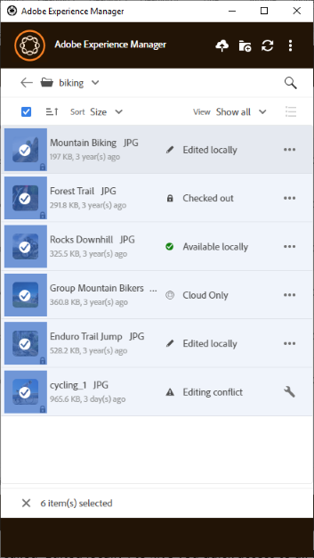

# Arbeiten mit mehreren Assets {#work-with-multiple-assets}

Benutzer können problemlos mit mehreren Assets arbeiten und diese verwalten, indem sie beispielsweise alle Bearbeitungen in einem Schritt hochladen oder verschachtelte Ordner mit wenigen Klicks hochladen.

## Durchsuchen großer Ordner {#browse-large-folders}

Wenn Sie mit Ordnern arbeiten, die viele Assets enthalten, führen Sie einen Bildlauf durch, um weitere Assets anzuzeigen. Um mit der Tastatur zu scrollen, drücken Sie die Tabulatortaste einige Male, um das Asset oben auszuwählen. Das jeweils ausgewählte Asset ist hervorgehoben. Verwenden Sie jetzt die Abwärtspfeiltaste, um durch die Liste der Assets zu navigieren.

## Schnellzugriff für ausgewählte Assets {#quick-actions-for-selected-assets}

Klicken Sie auf die Miniaturansicht einiger Assets, um die Assets auszuwählen. Um alle Assets auszuwählen, aktivieren Sie das Kontrollkästchen in der oberen Leiste des Programms. Die Aktionen, die für alle ausgewählten Assets gemeinsam gelten, werden in einer Symbolleiste am unteren Rand des Programms angezeigt.

Die in der Symbolleiste unten verfügbaren Aktionen hängen vom Status der ausgewählten Dateien ab. Wenn Sie beispielsweise nur Dateien mit dem Status **[!UICONTROL Edited Locally]** auswählen, wird das Symbol **[!UICONTROL Upload Changes]** angezeigt. Wenn Sie eine Mischung aus **[!UICONTROL Edited locally]** und **[!UICONTROL Cloud only]** auswählen, steht die Aktion **[!UICONTROL Upload Changes]** nicht zur Verfügung.

## Nächste Schritte {#next-steps}

* [Video zu den ersten Schritten mit dem Adobe Experience Manager Desktop-Programm ansehen](https://experienceleague.adobe.com/de/docs/experience-manager-learn/assets/creative-workflows/aem-desktop-app)

* Geben Sie Feedback zur Dokumentation über [!UICONTROL Edit this page] ) oder [!UICONTROL Log an issue]  in der rechten Seitenleiste

* Kontaktieren Sie die [Kundenunterstützung](https://experienceleague.adobe.com/de?support-solution=General#support)

>[!MORELIKETHIS]
>
>* [Hochladen von Assets](/help/using/upload-assets.md)
>* [Herunterladen von Assets](/help/using/download-assets.md)
>* [Suchen](/help/using/search.md)
